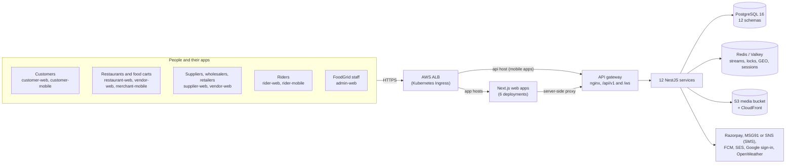
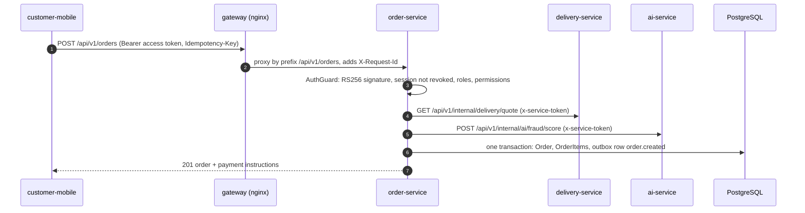
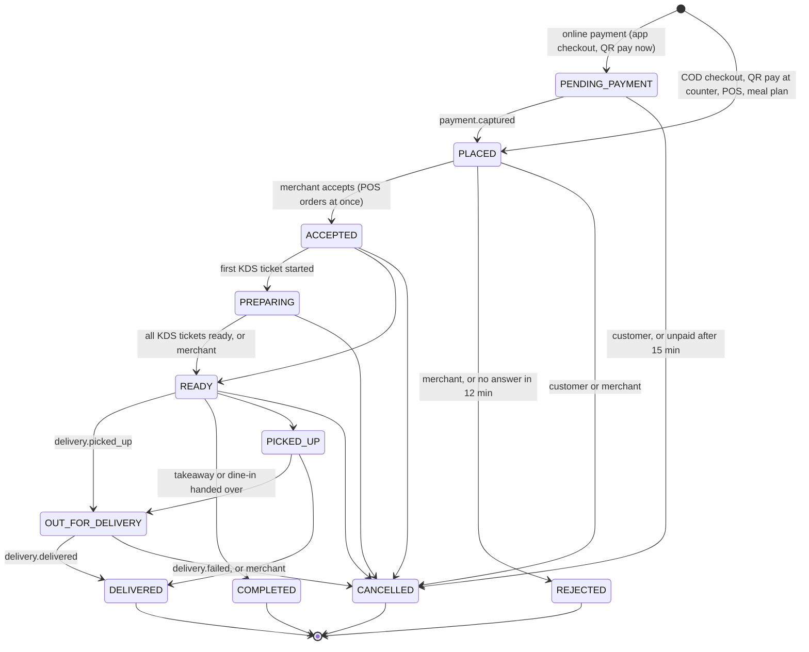
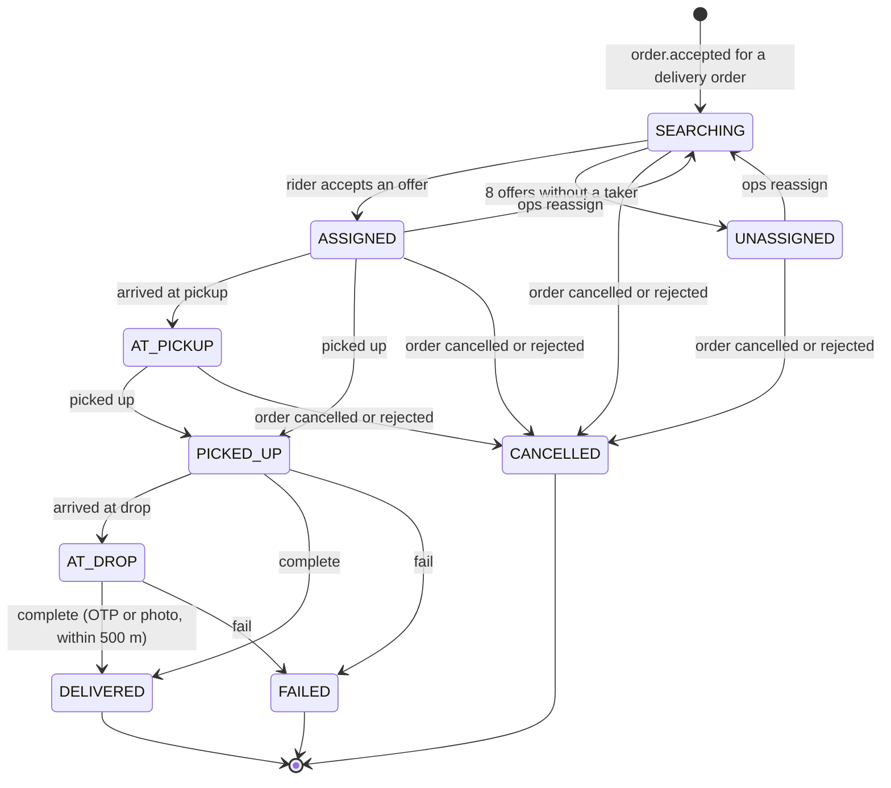
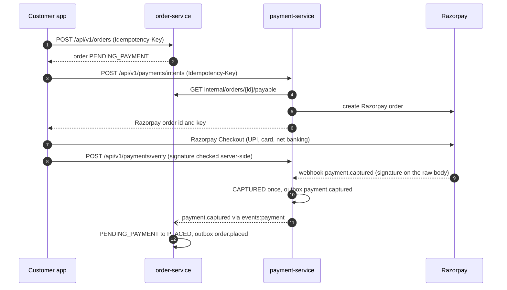

# Architecture

FoodGrid is one platform for three businesses: consumer food delivery, a restaurant
ERP (POS, kitchen display, inventory, purchasing) and a B2B supply marketplace. It is
built as 12 NestJS services behind one API gateway, six Next.js web apps and three
Flutter apps, on one PostgreSQL database split into a schema per bounded context, and
Redis for events, locks and live state.

- [System context](#system-context)
- [A request through the gateway](#a-request-through-the-gateway)
- [Bounded contexts and schemas](#bounded-contexts-and-schemas)
- [Services](#services)
- [Synchronous calls and events](#synchronous-calls-and-events)
- [Order and delivery state machines](#order-and-delivery-state-machines)
- [Multi-tenancy, roles and permissions](#multi-tenancy-roles-and-permissions)
- [Authentication](#authentication)
- [Payments](#payments)
- [Delivery](#delivery)
- [Realtime](#realtime)
- [Jobs and distributed locks](#jobs-and-distributed-locks)
- [Observability](#observability)
- [Security measures](#security-measures)

## System context

Browsers never call the gateway themselves: each web app's route handlers
(`app/api/auth/[action]` and `app/api/proxy/[...path]`, from `@foodgrid/auth/next`)
keep the tokens in httpOnly cookies and forward requests to `API_URL`. The mobile apps
call the gateway directly with a bearer token. In Kubernetes the public hosts are
`api.foodgrid.in` (gateway), `foodgrid.in` and `www.foodgrid.in` (customer-web),
`partner.` (restaurant-web), `business.` (vendor-web), `supplier.` (supplier-web),
`rider.` (rider-web) and `admin.` (admin-web, behind an IP allow-list); staging uses the
same names under `staging.foodgrid.in`.

## A request through the gateway

- **Routing.** `pnpm gateway:routes` derives the routing table from the OpenAPI specs
  in `docs/api` and writes `infrastructure/gateway/routes.json` (used by the dev
  gateway) and `infrastructure/docker/nginx/gateway.conf` (nginx). A path prefix maps
  to exactly one service; `/ws` goes to delivery-service; `/.well-known/jwks.json` to
  auth-service; `/api/v1/internal/*` returns 404 at the gateway.
- **Edge limits.** nginx rate-limits `POST /api/v1/auth/otp/request` and
  `/api/v1/auth/password` to 10 requests per minute per client IP (burst 5) and caps
  bodies at 10 MB.
- **Inside a service.** `bootstrapService()` (`packages/utils/src/server/bootstrap.ts`)
  applies the same conventions everywhere: global prefix `api/v1` (except
  `health/live`, `health/ready`, `metrics` and the JWKS), Helmet, CORS from
  `CORS_ORIGINS`, a whitelisting `ValidationPipe`, one error envelope
  (`statusCode`, `error`, `message`, `code`, `details`, `requestId`, `timestamp`,
  `path`), and Swagger UI at `/docs` (not routed by the gateway).
- **Degradation.** Calls on the checkout and discovery path have short timeouts and
  fall back instead of failing: the delivery quote (800 ms, falls back to a distance
  estimate), fraud scoring (800 ms, skipped) and sponsored listings (300 ms, none).

## Bounded contexts and schemas

One PostgreSQL database, one schema per context. Foreign keys exist only inside a
schema; references across contexts are plain ids kept consistent by
[domain events](./events.md), so a context could move to its own database. The full
model (99 models, 81 enums) is in [docs/database](./database/README.md), generated
from `packages/database/prisma/schema` by `pnpm docs:erd`.

| Schema                                       | Owner                      | Holds                                                                                                                             |
| -------------------------------------------- | -------------------------- | --------------------------------------------------------------------------------------------------------------------------------- |
| [identity](./database/identity.md)           | auth-service, user-service | users, OTP challenges, refresh tokens, OAuth accounts, tenants and members, addresses, approvals, audit log, CMS                  |
| [commerce](./database/commerce.md)           | order-service              | outlets, menus, orders and their status events, kitchen tickets, dining tables, coupons, reviews, memberships, meal subscriptions |
| [payments](./database/payments.md)           | payment-service            | payments, webhook events, refunds, wallets and wallet transactions, commission rules, settlements, payouts, GST invoices          |
| [delivery](./database/delivery.md)           | delivery-service           | rider profiles, deliveries, offers, zones, location pings, attendance, earnings, incentive schemes                                |
| [inventory](./database/inventory.md)         | inventory-service          | ingredients, FEFO stock batches, stock movements, recipes, production plans, cost snapshots, daily consumption                    |
| [procurement](./database/procurement.md)     | procurement-service        | demand forecasts, reorder alerts, supplier quotes, purchase orders, approvals, settings                                           |
| [marketplace](./database/marketplace.md)     | supplier-service           | products, categories, price tiers, seller zones and slots, territories, dealers, B2B orders, seller ratings and metrics           |
| [analytics](./database/analytics.md)         | analytics-service          | order facts and daily outlet, platform, rider and supplier stats (read models built from events)                                  |
| [ads](./database/ads.md)                     | ads-service                | campaigns, ad events, daily stats                                                                                                 |
| [notifications](./database/notifications.md) | notification-service       | notifications, templates, preferences, device tokens, push campaigns                                                              |
| [ai](./database/ai.md)                       | ai-service                 | model runs, external signals, fraud assessments, outlet scores, pricing suggestions                                               |
| [platform](./database/platform.md)           | shared                     | `OutboxEvent`, `ProcessedEvent`, `IdempotencyRecord`, `SequenceCounter` (gap-free order, PO and invoice numbers)                  |

## Services

| Service              | Port | Responsibilities                                                                                                                                                          | Consumes streams                                  |
| -------------------- | ---: | ------------------------------------------------------------------------------------------------------------------------------------------------------------------------- | ------------------------------------------------- |
| auth-service         | 4001 | OTP, Google and password login; access and refresh tokens; tenant switching; sessions; JWKS                                                                               | —                                                 |
| user-service         | 4002 | profiles and addresses, business onboarding and staff, approvals, admin user management, audit log, CMS, media upload URLs                                                | —                                                 |
| order-service        | 4003 | outlets, menus, discovery and search, cart and checkout, order lifecycle, KDS, POS, QR table ordering, coupons, reviews, memberships, meal subscriptions, recommendations | payment, delivery, identity                       |
| payment-service      | 4004 | Razorpay (UPI, cards, net banking) and wallet payments, refunds, wallet ledger, commissions and settlements, payouts, rider cash, GST invoices                            | order, delivery, marketplace                      |
| inventory-service    | 4005 | ingredients, stock batches and ledger, recipe-based consumption, recipes and costing, production planning                                                                 | order, procurement                                |
| procurement-service  | 4006 | demand forecasts, depletion prediction, reorder alerts, supplier comparison, automatic and manual purchase orders, approvals, PO tracking                                 | inventory, marketplace                            |
| delivery-service     | 4007 | riders, dispatch and offers, live tracking (Socket.IO), proof of delivery, attendance, earnings, incentives, zones and surge, heat maps                                   | order, identity                                   |
| supplier-service     | 4008 | B2B catalog, bulk pricing and MOQ, seller zones and slots, territories, dealers, B2B orders, seller analytics                                                             | procurement, identity                             |
| analytics-service    | 4009 | GMV, revenue, retention, outlet profitability, supplier and rider reports from event-fed read models; weekly outlet scores                                                | order, delivery, marketplace, inventory, identity |
| ads-service          | 4010 | sponsored listing campaigns, auction, budget pacing, impressions, clicks, conversions                                                                                     | order, identity                                   |
| notification-service | 4011 | push (FCM), SMS (MSG91 or SNS), email (SES) and in-app notifications, templates, device tokens, push campaigns                                                            | all seven used streams                            |
| ai-service           | 4012 | demand forecasting, dynamic pricing, inventory optimisation, supplier ranking, fraud scoring, route optimisation, recommendations, outlet scoring                         | —                                                 |

The HTTP routes of each service are in [docs/api](./api/README.md). Every service
exposes `GET /health/live`, `GET /health/ready` (database and Redis) and
`GET /metrics` on its own port.

## Synchronous calls and events

**Synchronous calls** are for questions that need an answer now (a delivery quote,
a fraud score, an amount to charge). They go through `InternalHttpService`
(`packages/utils/src/server/internal-http.service.ts`):

- Target `http://<service>:<port>` from `<NAME>_SERVICE_URL` (default
  `http://localhost:<port>`), path `/api/v1/internal/...`.
- Authenticated with an HS256 **service token** in `x-service-token` (60 s lifetime,
  audience `foodgrid-internal`, signed with `INTERNAL_SERVICE_SECRET`); routes accept it
  only when marked `@Internal()` or `@AllowService()`.
- 5 s timeout by default; GETs retry twice on network errors and 5xx (100 ms, 200 ms
  backoff); failures surface as `502 UPSTREAM_ERROR` or `503 UPSTREAM_UNAVAILABLE`.
- `DirectoryService` batches name look-ups (`internal/outlets/batch`,
  `internal/tenants/batch`, `internal/users/batch`, `internal/riders/batch`), caches
  them for 10 minutes and degrades to bare ids if the owner is down.

| Caller               | Calls                                | For                                                                                                    |
| -------------------- | ------------------------------------ | ------------------------------------------------------------------------------------------------------ |
| auth-service         | notification                         | OTP SMS                                                                                                |
| user-service         | auth                                 | revoking a blocked user's sessions                                                                     |
| order-service        | delivery, ai, ads, user              | delivery quote, fraud score and recommendations, sponsored outlets, outlet approval requests           |
| payment-service      | order, supplier, ads, user           | the payable amount for each payment purpose; names for admin lists                                     |
| inventory-service    | order                                | menu prices and item sales for costing                                                                 |
| procurement-service  | inventory, supplier, order, ai, user | stock status, supplier offers and orders, sales history, forecasts and ranking                         |
| delivery-service     | ai, order, notification, user        | surge and fraud checks, outlet ownership for socket rooms, rider offer pushes, rider approval requests |
| supplier-service     | user                                 | seller tenant details (cached in Redis)                                                                |
| ads-service          | user                                 | campaign approval requests                                                                             |
| notification-service | user                                 | contact details and tenant members                                                                     |
| analytics-service    | ai, delivery, order, user            | weekly outlet scores; rider look-up and names for reports                                              |
| ai-service           | order, inventory                     | sales and stock history                                                                                |

**Events** carry facts that other contexts react to: an order was accepted, a payment
captured, a delivery completed. They use a transactional outbox, Redis Streams and
one consumer group per service; delivery is at-least-once with per-handler
de-duplication. The catalog and the mechanics are in [events.md](./events.md).

## Order and delivery state machines

Both are explicit `StateMachine` tables: `orderStateMachine` in
`services/order-service/src/domain/order-state.ts` and `deliveryStateMachine` in
`services/delivery-service/src/deliveries/deliveries.service.ts`. Every order status
change goes through `OrderLifecycleService.transition()`, which locks the order row
(`SELECT … FOR UPDATE`), checks the table, stamps the timestamp, appends an
`OrderStatusEvent` and writes the domain event to the outbox in one transaction.

- Customers may cancel only while `PENDING_PAYMENT` or `PLACED`; merchants must give a
  reason to reject or cancel, and cannot complete a delivery order themselves.
- `PICKED_UP` is allowed by the table but no code path sets it today: rider pickup
  moves the order straight to `OUT_FOR_DELIVERY` (both publish `order.picked_up`).
- Entering `ACCEPTED` creates the kitchen tickets; `CANCELLED` / `REJECTED` cancels them
  and releases the coupon redemption. A cancelled or rejected order that was paid is
  refunded by payment-service on `order.cancelled` / `order.rejected`.
- The 15-minute and 12-minute timeouts are the `expireUnpaid` and `rejectUnaccepted`
  jobs in `order-jobs.service.ts` (the latter only for `APP` and `WEB` orders, and
  scheduled orders only when due within 30 minutes).

- `PICKED_UP`, `DELIVERED` and `FAILED` publish `delivery.picked_up`,
  `delivery.delivered` and `delivery.failed`; accepting an offer publishes
  `delivery.assigned`. order-service follows with `OUT_FOR_DELIVERY`, `DELIVERED` or
  `CANCELLED`.
- The cancellation handler (`order.cancelled` / `order.rejected`) writes `CANCELLED`
  directly for any delivery not yet `DELIVERED`, `FAILED` or `CANCELLED`, so an order
  cancelled while out for delivery also cancels a `PICKED_UP` or `AT_DROP` delivery.
- Ops reassignment (`POST /api/v1/admin/deliveries/{id}/reassign`) also writes
  `SEARCHING` directly, resets the attempts and sends the chosen rider a 2-minute offer;
  it is refused once the delivery is picked up. The table additionally allows
  `UNASSIGNED → ASSIGNED`, which no code path uses.
- Each status change is pushed to the order's socket room as `delivery:status`.

## Multi-tenancy, roles and permissions

- **Tenants** are businesses: `RESTAURANT`, `FOOD_CART`, `SUPPLIER`, `WHOLESALER`,
  `RETAILER` (and `PLATFORM`), with status `PENDING_APPROVAL`, `ACTIVE`, `SUSPENDED` or
  `REJECTED`. A new business is created with `POST /api/v1/tenants` and becomes active
  through the approvals queue in admin-web.
- **Memberships** (`identity.TenantMember`) link a user to a tenant with one tenant role
  and an optional list of `outletIds` (empty means every outlet). A user can belong to
  several tenants and picks one with `POST /api/v1/auth/switch-tenant`.
- **Access token claims** carry `sub`, `sid`, platform `roles`, and for the active
  tenant `tenantId`, `tenantType`, `tenantRole` and `outletIds`.
- **Data isolation.** Merchant-facing queries use `prisma.forTenant(tenantId)`
  (`packages/database/src/tenant-scope.ts`), which adds the tenant to every read and
  stamps it on every write for the 33 tenant-partitioned models; a cross-tenant access
  raises `TenantScopeViolationError` (HTTP 403 `TENANT_SCOPE`).
- **Guards.** One global `AuthGuard` (`packages/auth/src/nest/auth.guard.ts`) runs
  `@Public` → `@Internal` (service token) → access token → session revocation →
  `@Roles(...)` (platform roles; `ADMIN` always passes) → `@RequireTenant(...types)` →
  `@RequirePermissions(...)`. Denials return `403` with a readable message and a code
  (`FORBIDDEN`, `TENANT_REQUIRED`, `TENANT_TYPE_MISMATCH`, `PERMISSION_DENIED`).

Permissions (`packages/auth/src/permissions.ts`):

| Tenant role         | Permissions                                                                                    |
| ------------------- | ---------------------------------------------------------------------------------------------- |
| OWNER               | every merchant and seller permission                                                           |
| MANAGER             | all of OWNER's except `procurement:approve` and `settings:manage`                              |
| CHEF                | `orders:read`, `kds:operate`, `inventory:read`, `recipes:manage`, `production:manage`          |
| CASHIER             | `orders:read`, `orders:manage`, `pos:operate`, `kds:operate`                                   |
| STAFF               | `orders:read`, `kds:operate`                                                                   |
| ACCOUNTANT          | `orders:read`, `reports:read`, `finance:read`, `procurement:read`, `inventory:read`            |
| PROCUREMENT_MANAGER | `inventory:read`, `inventory:manage`, `procurement:read`, `procurement:manage`, `reports:read` |

| Platform role   | Permissions                                                                                              |
| --------------- | -------------------------------------------------------------------------------------------------------- |
| CUSTOMER, RIDER | none (rider routes use `@Roles('RIDER')`)                                                                |
| ADMIN           | every `platform:*` permission                                                                            |
| SUPPORT         | `platform:users:read`, `platform:fraud`                                                                  |
| FINANCE         | `platform:finance`, `platform:analytics`, `platform:users:read`                                          |
| OPS             | `platform:approvals`, `platform:riders`, `platform:users:read`, `platform:analytics`, `platform:content` |

Each web app admits only its audience at sign-in: admin-web the staff roles,
restaurant-web `RESTAURANT` tenants, vendor-web `FOOD_CART`, `WHOLESALER` and
`RETAILER`, supplier-web `SUPPLIER`, rider-web the `RIDER` role.

## Authentication

| Mechanism          | Details                                                                                                                                                                                                                                                                                                                                                                                                                                                      |
| ------------------ | ------------------------------------------------------------------------------------------------------------------------------------------------------------------------------------------------------------------------------------------------------------------------------------------------------------------------------------------------------------------------------------------------------------------------------------------------------------ |
| Phone OTP          | 6 digits, valid 5 minutes, 5 attempts. Stored as an HMAC (`OTP_SECRET`) bound to the phone. Rate limits in Redis: one request per 30 s and 5 per hour per phone, 30 per hour per IP (`otp:*` keys), plus the gateway limit. Sent through notification-service. `OTP_EXPOSE_IN_RESPONSE=true` returns `devCode` outside production; numbers in `OTP_TEST_NUMBERS` always get `123456`. First login creates the user and publishes `identity.user.registered`. |
| Google             | ID token verified against `GOOGLE_CLIENT_IDS`; links or creates the user.                                                                                                                                                                                                                                                                                                                                                                                    |
| Email and password | Back office and merchant staff. bcrypt; 5 failures lock the email for 15 minutes.                                                                                                                                                                                                                                                                                                                                                                            |
| Access token       | RS256 JWT, 15 minutes (`JWT_ACCESS_TTL_SECONDS`), issuer `JWT_ISSUER`, audience `JWT_AUDIENCE`, key id `foodgrid-1`. Only auth-service holds the private key; every service verifies with `JWT_PUBLIC_KEY_BASE64`; the public key is also served at `/.well-known/jwks.json`.                                                                                                                                                                                |
| Refresh token      | Opaque random token, stored hashed, 30 days (`JWT_REFRESH_TTL_DAYS`). Each login starts a **family** whose id is the access token's `sid`. Every refresh rotates the token; reusing a rotated token more than 15 s later revokes the whole family (`REFRESH_REUSED`).                                                                                                                                                                                        |
| Revocation         | Logout, `DELETE /api/v1/auth/sessions/{id}`, reuse detection, an inactive account and admin blocking revoke the family and set `auth:revoked:<sid>` in Redis for the access token's lifetime, so outstanding access tokens stop working at once (`SESSION_REVOKED`).                                                                                                                                                                                         |
| Service tokens     | HS256, 60 s, `x-service-token`; see [synchronous calls](#synchronous-calls-and-events).                                                                                                                                                                                                                                                                                                                                                                      |
| Clients            | Web apps keep the tokens in httpOnly cookies `fg_at` and `fg_rt` and refresh in middleware; the Flutter apps keep them in Keychain / Keystore and refresh once on a 401.                                                                                                                                                                                                                                                                                     |

## Payments

- **Gateway.** `PaymentGateway` has two implementations: Razorpay, used when
  `RAZORPAY_KEY_ID` and `RAZORPAY_KEY_SECRET` are set, and a sandbox used otherwise
  (refused when `NODE_ENV=production`). The sandbox is completed with
  `POST /api/v1/payments/sandbox/{paymentId}/complete`.
- **Purposes and methods.** A payment pays for an `ORDER`, `WALLET_TOPUP`,
  `MEMBERSHIP`, `MEAL_SUBSCRIPTION`, `B2B_ORDER` or `AD_CAMPAIGN`; payment-service asks
  the owning service for the amount due (`internal/.../payable`) instead of trusting
  the client. Methods are UPI, card, net banking, wallet (Razorpay) and the FoodGrid
  wallet; orders can also be cash on delivery or cash at the counter.

- **Webhooks.** `POST /api/v1/payments/webhooks/razorpay` verifies
  `x-razorpay-signature` over the raw body and stores each event once
  (`payments.PaymentWebhookEvent`, unique by event id) before acting on it, so the
  webhook and the client's verify call can race safely; only the first capture
  publishes `payment.captured`.
- **Wallet ledger.** `WalletLedgerService` writes every credit and debit as a
  `WalletTransaction` with a unique idempotency key and updates the balance with an
  optimistic `version` check. Balances may only go negative where explicitly allowed
  (COD collection). `GET /api/v1/admin/wallets/{id}/reconcile` replays the ledger
  against the stored balance.
- **Refunds.** `order.cancelled`, `order.rejected` and `marketplace.order.rejected`
  refund every captured payment for the reference; wallet-funded payments refund to the
  wallet, others to the instrument (or to the wallet on request).
- **Settlements.** Delivered and completed orders accrue a settlement line and the
  customer's GST invoice, using the most specific active commission rule (outlet, then
  tenant, then tenant type, then priority). A weekly job (Monday 03:00 IST) groups
  unsettled lines into settlements and issues the commission invoices. Riders cash out
  through payouts that finance marks paid or failed.
- **Idempotency.** `IdempotencyInterceptor` on checkout (`POST /api/v1/orders`),
  payment intents and rider payouts stores the response per user, route and
  `Idempotency-Key` in Redis for 24 hours: a retry gets the stored response
  (`Idempotent-Replayed: true`), a concurrent duplicate `409 IDEMPOTENCY_IN_PROGRESS`,
  and a reused key with a different body `409 IDEMPOTENCY_MISMATCH`.

## Delivery

- **Dispatch.** On `order.accepted` for a delivery order, delivery-service creates the
  delivery: zone by point-in-polygon on the pickup, distance, rider earning from the
  zone tariff and current surge, and the handover OTP from the order. It then offers it
  to the best rider found by a Redis GEO search (`riders:geo`) among active, online
  riders with a fix in the last 5 minutes. Candidates are scored on proximity (50 %),
  acceptance rate (20 %), rating (15 %) and idle time (15 %), riders with two active
  deliveries are skipped and riders with one are penalised. The radius widens from 3 to
  5, 8 and 12 km every two attempts.
- **Offers** last 45 s and go to the rider's socket room (`offer:new`) and as a push.
  Rejection or expiry lowers the rider's acceptance rate and the next rider is tried;
  a sweep every 10 s expires offers and re-dispatches. After 8 attempts the delivery is
  `UNASSIGNED` and the ops room gets `delivery:unassigned`; ops can force-assign with
  `POST /api/v1/admin/deliveries/{id}/reassign`.
- **Geofence and proof.** Completing needs the customer's OTP or a proof photo, the
  cash for COD orders, and a rider position no older than 5 minutes within 0.5 km of
  the drop point (`TOO_FAR_FROM_DROP`, `LOCATION_REQUIRED` otherwise). Riders that are
  not on a delivery and stop sending positions for 10 minutes are taken offline.
- **Earnings and incentives.** Completion writes earnings lines (base, distance,
  surge, tip), attendance and incentive progress in the same transaction; a reached
  target publishes `delivery.incentive.achieved`.
- **COD netting.** On `delivery.delivered` payment-service credits the rider wallet
  with the earning and the tip and debits the cash collected for COD orders. A negative
  rider balance is cash the rider holds beyond what they earned; finance sees it in
  `GET /api/v1/admin/rider-cash` and records hand-ins with
  `POST /api/v1/admin/rider-cash/{userId}/deposits` (see the
  [rider cash runbook](./runbooks.md#rider-cash-reconciliation)).

## Realtime

delivery-service hosts a Socket.IO server: path `/ws`, namespace `/tracking`, with the
Redis adapter so any replica can emit to any room. Clients authenticate with the access
token in `auth.token` (or an `Authorization` header) when connecting.

| Room                | Who joins                                                                                                                   | Server events                                    |
| ------------------- | --------------------------------------------------------------------------------------------------------------------------- | ------------------------------------------------ |
| `order:<orderId>`   | the customer, staff of the order's tenant, ADMIN / OPS / SUPPORT, after `order:subscribe`                                   | `rider:location`, `delivery:status`              |
| `rider:<riderId>`   | the rider, automatically                                                                                                    | `offer:new`, `order:ready`, `delivery:cancelled` |
| `outlet:<outletId>` | merchant staff with `orders:read` and access to the outlet, after `outlet:subscribe` (ownership checked with order-service) | `order:new`, `order:status`                      |
| `ops`               | ADMIN, OPS, SUPPORT, automatically                                                                                          | `rider:location`, `delivery:unassigned`          |

The Flutter apps use these rooms (customer tracking, rider offers, the merchant order
board with its new-order chime); the web dashboards poll.

## Jobs and distributed locks

Scheduled jobs run in every replica (`@nestjs/schedule`) but do their work only when
`withLock()` (`packages/utils/src/server/distributed-lock.ts`) wins
`SET lock:<key> <token> NX EX <ttl>`; the lock is released with a compare-and-delete
Lua script.

| Service              | Schedule         | Lock key                            | Job                                                      |
| -------------------- | ---------------- | ----------------------------------- | -------------------------------------------------------- |
| order-service        | every minute     | `order:expire-unpaid`               | cancel orders unpaid for 15 minutes                      |
| order-service        | every minute     | `order:reject-unaccepted`           | reject app and web orders not accepted within 12 minutes |
| order-service        | 06:00 IST        | `order:meal-subscriptions`          | create today's meal-subscription orders                  |
| delivery-service     | every 10 s       | `delivery:sweep`                    | expire offers, re-dispatch searching deliveries          |
| delivery-service     | every minute     | `delivery:surge`                    | recompute zone surge                                     |
| delivery-service     | every 5 minutes  | `delivery:stale-riders`             | take riders silent for 10 minutes offline                |
| inventory-service    | 02:00 IST        | `inventory:cost-snapshots`          | food-cost snapshots per outlet                           |
| inventory-service    | hourly at :15    | `inventory:expire-batches`          | zero depleted, expired batches                           |
| procurement-service  | 05:00 IST        | `procurement:nightly`               | forecasts, reorder alerts and automatic POs              |
| payment-service      | Monday 03:00 IST | `payments:weekly-settlement`        | weekly merchant settlements                              |
| analytics-service    | Monday 04:00 IST | `analytics:weekly-scores`           | outlet performance scores                                |
| notification-service | every minute     | `notifications:scheduled-campaigns` | send scheduled push campaigns                            |

## Observability

- **Logs.** pino JSON on stdout with `service`, a request id (`x-request-id`, set by
  the gateway or generated) and authorization, cookie and service-token headers
  redacted; pretty-printed only in development. In EKS, Fluent Bit ships them to the
  CloudWatch log group `/aws/eks/<cluster>/containers`, one stream per container.
- **Metrics.** `GET /metrics` (prom-client, label `service`):
  `http_request_duration_seconds{method,route,status}`, Node.js defaults,
  `domain_events_published_total`, `domain_events_processed_total`, and business
  counters such as `orders_created_total`, `orders_status_transitions_total`,
  `payments_captured_total`, `payments_failed_total`, `delivery_offers_total`,
  `deliveries_completed_total`, `notifications_sent_total`, `ad_events_total` and
  `ai_inferences_total`.
- **Health.** `/health/live` (process only; liveness and startup probes) and
  `/health/ready` (database and Redis; readiness probe and ALB health check).
- **Alerting.** `infrastructure/monitoring` holds the ServiceMonitor, the
  PrometheusRules and the Grafana dashboard `foodgrid-overview`; Alertmanager sends to
  the environment's SNS alarm topic. Every alert links to a section of
  [runbooks.md](./runbooks.md).

## Security measures

- TLS 1.3 policy on the ALB, HTTP redirected to HTTPS; WAF on production; admin-web
  reachable only from an allow-listed CIDR.
- Internal routes blocked at the gateway and protected by service tokens; Kubernetes
  NetworkPolicies deny ingress by default and let only the gateway and other services
  reach a service pod (plus Prometheus from the `monitoring` namespace).
- Pods run as non-root with a read-only root filesystem, no capabilities and the
  `RuntimeDefault` seccomp profile; secrets come from AWS Secrets Manager through
  External Secrets; AWS access uses IRSA (`foodgrid-<env>-app`), not keys.
- Short-lived access tokens, rotating refresh tokens with reuse detection, server-side
  session revocation, OTP and password rate limits, httpOnly cookies on the web.
- Strict request validation (unknown fields rejected), Helmet headers, CORS
  allow-list, tenant-scoped data access and per-permission guards.
- Razorpay signatures checked on the raw body; `Idempotency-Key` honoured on checkout,
  payment intents and rider payouts; ledger entries with unique idempotency keys.
- The delivery OTP is never sent to merchant clients; delivery completion is
  geofenced; checkout runs fraud scoring (block, or no COD for orders under review).
