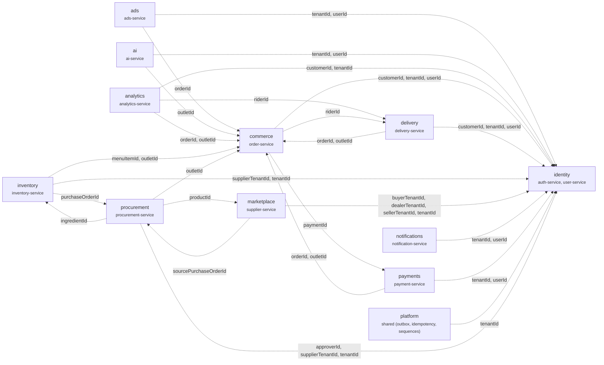

# FoodGrid data model

Generated by `pnpm docs:erd` from `packages/database/prisma/schema` — do not edit by hand.

99 models and 81 enums in 12 PostgreSQL schemas, one per bounded context. Foreign keys exist only within a context; references across contexts are plain ids kept consistent through domain events (transactional outbox → Redis Streams), so any context can move to its own database.

| Context (schema) | Owner | Models |
| --- | --- | ---: |
| [identity](./identity.md) | auth-service, user-service | 11 |
| [commerce](./commerce.md) | order-service | 18 |
| [payments](./payments.md) | payment-service | 10 |
| [delivery](./delivery.md) | delivery-service | 9 |
| [inventory](./inventory.md) | inventory-service | 9 |
| [procurement](./procurement.md) | procurement-service | 8 |
| [marketplace](./marketplace.md) | supplier-service | 12 |
| [analytics](./analytics.md) | analytics-service | 5 |
| [ads](./ads.md) | ads-service | 3 |
| [notifications](./notifications.md) | notification-service | 5 |
| [ai](./ai.md) | ai-service | 5 |
| [platform](./platform.md) | shared (outbox, idempotency, sequences) | 4 |

## Context map

Dashed edges are logical id references (no foreign key), labelled with the referencing fields.

