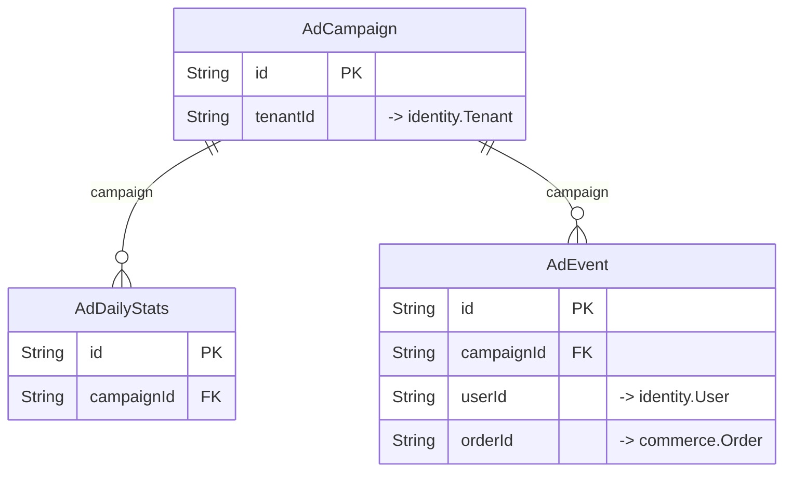

# `ads` schema

Owner: ads-service · 3 models · [all contexts](./README.md)

The diagram shows keys and relations; every column is listed in the reference below.

## AdCampaign

Table `ads."AdCampaign"`

| Column | Type | Null | Default | Notes |
| --- | --- | :---: | --- | --- |
| `id` | String |  | cuid() | PK |
| `tenantId` | String |  |  | → identity.Tenant |
| `name` | String |  |  |  |
| `placement` | enum AdPlacement |  |  |  |
| `targetType` | enum AdTargetType |  |  |  |
| `targetId` | String |  |  |  |
| `status` | enum CampaignStatus |  | DRAFT |  |
| `bidType` | enum BidType |  | CPC |  |
| `bidAmount` | Decimal |  |  |  |
| `dailyBudget` | Decimal |  |  |  |
| `totalBudget` | Decimal |  |  |  |
| `spent` | Decimal |  | 0 |  |
| `spentToday` | Decimal |  | 0 |  |
| `spentTodayDate` | DateTime | ✓ |  |  |
| `keywords` | String[] |  | [] |  |
| `cities` | String[] |  | [] |  |
| `startsAt` | DateTime |  |  |  |
| `endsAt` | DateTime | ✓ |  |  |
| `creative` | Json |  | {} | { "title": "...", "imageUrl": "...", "cta": "Order now" } |
| `reviewedBy` | String | ✓ |  |  |
| `reviewNotes` | String | ✓ |  |  |
| `createdAt` | DateTime |  | now() |  |
| `updatedAt` | DateTime |  |  |  |

## AdDailyStats

Table `ads."AdDailyStats"`

| Column | Type | Null | Default | Notes |
| --- | --- | :---: | --- | --- |
| `id` | String |  | cuid() | PK |
| `campaignId` | String |  |  |  |
| `date` | DateTime |  |  |  |
| `impressions` | Int |  | 0 |  |
| `clicks` | Int |  | 0 |  |
| `conversions` | Int |  | 0 |  |
| `spend` | Decimal |  | 0 |  |
| `revenue` | Decimal |  | 0 |  |

Constraints: unique (campaignId, date)

## AdEvent

Table `ads."AdEvent"`

| Column | Type | Null | Default | Notes |
| --- | --- | :---: | --- | --- |
| `id` | String |  | cuid() | PK |
| `campaignId` | String |  |  |  |
| `type` | enum AdEventType |  |  |  |
| `userId` | String | ✓ |  | → identity.User |
| `sessionId` | String | ✓ |  |  |
| `cost` | Decimal |  | 0 |  |
| `orderId` | String | ✓ |  | → commerce.Order |
| `context` | Json | ✓ |  |  |
| `createdAt` | DateTime |  | now() |  |
