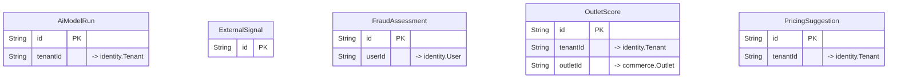

# `ai` schema

Owner: ai-service · 5 models · [all contexts](./README.md)

The diagram shows keys and relations; every column is listed in the reference below.

## AiModelRun

Table `ai."AiModelRun"`

| Column | Type | Null | Default | Notes |
| --- | --- | :---: | --- | --- |
| `id` | String |  | cuid() | PK |
| `kind` | enum AiModelKind |  |  |  |
| `tenantId` | String | ✓ |  | → identity.Tenant |
| `scope` | Json | ✓ |  |  |
| `success` | Boolean |  | true |  |
| `metrics` | Json | ✓ |  |  |
| `durationMs` | Int |  |  |  |
| `error` | String | ✓ |  |  |
| `createdAt` | DateTime |  | now() |  |

## ExternalSignal

Exogenous demand drivers for forecasting. city = null means nationwide.

Table `ai."ExternalSignal"`

| Column | Type | Null | Default | Notes |
| --- | --- | :---: | --- | --- |
| `id` | String |  | cuid() | PK |
| `type` | enum SignalType |  |  |  |
| `name` | String |  |  |  |
| `city` | String | ✓ |  |  |
| `date` | DateTime |  |  |  |
| `impact` | Float |  | 1 | Expected demand multiplier (1.0 = neutral). |
| `categories` | String[] |  | [] | Ingredient categories most affected (empty = all). |
| `data` | Json |  | {} |  |
| `createdAt` | DateTime |  | now() |  |

Constraints: unique (type, name, city, date)

## FraudAssessment

Table `ai."FraudAssessment"`

| Column | Type | Null | Default | Notes |
| --- | --- | :---: | --- | --- |
| `id` | String |  | cuid() | PK |
| `entityType` | enum FraudEntityType |  |  |  |
| `entityId` | String |  |  |  |
| `userId` | String | ✓ |  | → identity.User |
| `score` | Float |  |  |  |
| `decision` | enum FraudDecision |  |  |  |
| `reasons` | String[] |  | [] |  |
| `features` | Json |  |  |  |
| `reviewedBy` | String | ✓ |  |  |
| `reviewOutcome` | String | ✓ |  |  |
| `reviewedAt` | DateTime | ✓ |  |  |
| `createdAt` | DateTime |  | now() |  |

## OutletScore

Table `ai."OutletScore"`

| Column | Type | Null | Default | Notes |
| --- | --- | :---: | --- | --- |
| `id` | String |  | cuid() | PK |
| `tenantId` | String |  |  | → identity.Tenant |
| `outletId` | String |  |  | → commerce.Outlet |
| `periodStart` | DateTime |  |  |  |
| `periodEnd` | DateTime |  |  |  |
| `score` | Float |  |  |  |
| `grade` | String |  |  |  |
| `components` | Json |  |  |  |
| `recommendations` | String[] |  | [] |  |
| `createdAt` | DateTime |  | now() |  |

Constraints: unique (outletId, periodStart, periodEnd)

## PricingSuggestion

Table `ai."PricingSuggestion"`

| Column | Type | Null | Default | Notes |
| --- | --- | :---: | --- | --- |
| `id` | String |  | cuid() | PK |
| `tenantId` | String | ✓ |  | → identity.Tenant |
| `targetType` | enum PricingTargetType |  |  |  |
| `targetId` | String |  |  |  |
| `targetName` | String | ✓ |  |  |
| `currentPrice` | Decimal |  |  |  |
| `suggestedPrice` | Decimal |  |  |  |
| `changePct` | Float |  |  |  |
| `reason` | String |  |  |  |
| `confidence` | Float |  |  |  |
| `factors` | Json |  | {} |  |
| `status` | enum SuggestionStatus |  | SUGGESTED |  |
| `validUntil` | DateTime | ✓ |  |  |
| `appliedAt` | DateTime | ✓ |  |  |
| `createdAt` | DateTime |  | now() |  |
