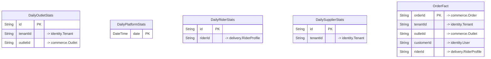

# `analytics` schema

Owner: analytics-service · 5 models · [all contexts](./README.md)

The diagram shows keys and relations; every column is listed in the reference below.

## DailyOutletStats

Table `analytics."DailyOutletStats"`

| Column | Type | Null | Default | Notes |
| --- | --- | :---: | --- | --- |
| `id` | String |  | cuid() | PK |
| `date` | DateTime |  |  |  |
| `tenantId` | String |  |  | → identity.Tenant |
| `outletId` | String |  |  | → commerce.Outlet |
| `orders` | Int |  | 0 |  |
| `cancelledOrders` | Int |  | 0 |  |
| `gmv` | Decimal |  | 0 |  |
| `netSales` | Decimal |  | 0 |  |
| `discounts` | Decimal |  | 0 |  |
| `commission` | Decimal |  | 0 |  |
| `foodCost` | Decimal |  | 0 |  |
| `grossProfit` | Decimal |  | 0 |  |
| `avgPrepMins` | Float | ✓ |  |  |
| `newCustomers` | Int |  | 0 |  |
| `repeatCustomers` | Int |  | 0 |  |
| `updatedAt` | DateTime |  |  |  |

Constraints: unique (outletId, date)

## DailyPlatformStats

Table `analytics."DailyPlatformStats"`

| Column | Type | Null | Default | Notes |
| --- | --- | :---: | --- | --- |
| `date` | DateTime |  |  | PK |
| `gmv` | Decimal |  | 0 |  |
| `revenue` | Decimal |  | 0 |  |
| `orders` | Int |  | 0 |  |
| `cancelledOrders` | Int |  | 0 |  |
| `activeCustomers` | Int |  | 0 |  |
| `newCustomers` | Int |  | 0 |  |
| `activeOutlets` | Int |  | 0 |  |
| `activeRiders` | Int |  | 0 |  |
| `deliveries` | Int |  | 0 |  |
| `b2bOrders` | Int |  | 0 |  |
| `b2bGmv` | Decimal |  | 0 |  |
| `updatedAt` | DateTime |  |  |  |

## DailyRiderStats

Table `analytics."DailyRiderStats"`

| Column | Type | Null | Default | Notes |
| --- | --- | :---: | --- | --- |
| `id` | String |  | cuid() | PK |
| `date` | DateTime |  |  |  |
| `riderId` | String |  |  | → delivery.RiderProfile |
| `deliveries` | Int |  | 0 |  |
| `earnings` | Decimal |  | 0 |  |
| `distanceKm` | Float |  | 0 |  |
| `onlineMinutes` | Int |  | 0 |  |
| `avgDeliveryMins` | Float | ✓ |  |  |
| `offers` | Int |  | 0 |  |
| `accepted` | Int |  | 0 |  |
| `rejected` | Int |  | 0 |  |
| `updatedAt` | DateTime |  |  |  |

Constraints: unique (riderId, date)

## DailySupplierStats

Table `analytics."DailySupplierStats"`

| Column | Type | Null | Default | Notes |
| --- | --- | :---: | --- | --- |
| `id` | String |  | cuid() | PK |
| `date` | DateTime |  |  |  |
| `tenantId` | String |  |  | → identity.Tenant |
| `orders` | Int |  | 0 |  |
| `gmv` | Decimal |  | 0 |  |
| `unitsSold` | Decimal |  | 0 |  |
| `deliveredOrders` | Int |  | 0 |  |
| `onTimeDeliveries` | Int |  | 0 |  |
| `rejectedOrders` | Int |  | 0 |  |
| `updatedAt` | DateTime |  |  |  |

Constraints: unique (tenantId, date)

## OrderFact

Table `analytics."OrderFact"`

| Column | Type | Null | Default | Notes |
| --- | --- | :---: | --- | --- |
| `orderId` | String |  |  | PK; → commerce.Order |
| `orderNumber` | String |  |  |  |
| `date` | DateTime |  |  |  |
| `hour` | Int |  |  |  |
| `tenantId` | String |  |  | → identity.Tenant |
| `outletId` | String |  |  | → commerce.Outlet |
| `outletType` | String |  |  |  |
| `city` | String | ✓ |  |  |
| `customerId` | String | ✓ |  | → identity.User |
| `channel` | String |  |  |  |
| `orderType` | String |  |  |  |
| `status` | String |  |  |  |
| `paymentMethod` | String | ✓ |  |  |
| `itemsCount` | Int |  |  |  |
| `gmv` | Decimal |  |  |  |
| `subtotal` | Decimal |  |  |  |
| `discount` | Decimal |  |  |  |
| `deliveryFee` | Decimal |  |  |  |
| `tax` | Decimal |  |  |  |
| `commission` | Decimal |  | 0 |  |
| `platformRevenue` | Decimal |  | 0 |  |
| `foodCost` | Decimal |  | 0 |  |
| `isFirstOrder` | Boolean |  | false |  |
| `prepMins` | Int | ✓ |  |  |
| `deliveryMins` | Int | ✓ |  |  |
| `riderId` | String | ✓ |  | → delivery.RiderProfile |
| `placedAt` | DateTime |  |  |  |
| `deliveredAt` | DateTime | ✓ |  |  |
| `updatedAt` | DateTime |  |  |  |
