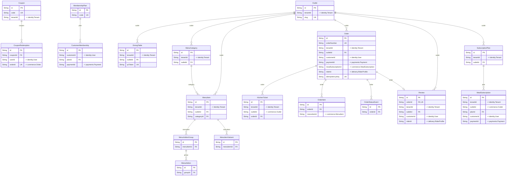

# `commerce` schema

Owner: order-service · 18 models · [all contexts](./README.md)

The diagram shows keys and relations; every column is listed in the reference below.

## Coupon

Table `commerce."Coupon"`

| Column | Type | Null | Default | Notes |
| --- | --- | :---: | --- | --- |
| `id` | String |  | cuid() | PK |
| `code` | String |  |  | unique |
| `tenantId` | String | ✓ |  | → identity.Tenant; null = platform-wide coupon. |
| `outletIds` | String[] |  | [] |  |
| `title` | String |  |  |  |
| `description` | String | ✓ |  |  |
| `type` | enum CouponType |  |  |  |
| `value` | Decimal |  |  |  |
| `maxDiscount` | Decimal | ✓ |  |  |
| `minOrderValue` | Decimal |  | 0 |  |
| `usageLimit` | Int | ✓ |  |  |
| `perUserLimit` | Int |  | 1 |  |
| `usedCount` | Int |  | 0 |  |
| `firstOrderOnly` | Boolean |  | false |  |
| `membersOnly` | Boolean |  | false |  |
| `paymentMethods` | enum PaymentMethod[] |  | [] |  |
| `fundedBy` | enum FundingSource |  | PLATFORM |  |
| `validFrom` | DateTime |  |  |  |
| `validTo` | DateTime |  |  |  |
| `isActive` | Boolean |  | true |  |
| `createdAt` | DateTime |  | now() |  |
| `updatedAt` | DateTime |  |  |  |

## CouponRedemption

Table `commerce."CouponRedemption"`

| Column | Type | Null | Default | Notes |
| --- | --- | :---: | --- | --- |
| `id` | String |  | cuid() | PK |
| `couponId` | String |  |  |  |
| `userId` | String |  |  | → identity.User |
| `orderId` | String |  |  | unique; → commerce.Order |
| `discount` | Decimal |  |  |  |
| `createdAt` | DateTime |  | now() |  |

## CustomerMembership

Table `commerce."CustomerMembership"`

| Column | Type | Null | Default | Notes |
| --- | --- | :---: | --- | --- |
| `id` | String |  | cuid() | PK |
| `customerId` | String |  |  | → identity.User |
| `planId` | String |  |  |  |
| `status` | enum CustomerMembershipStatus |  | PENDING_PAYMENT |  |
| `startsAt` | DateTime |  |  |  |
| `endsAt` | DateTime |  |  |  |
| `paymentId` | String | ✓ |  | → payments.Payment |
| `autoRenew` | Boolean |  | false |  |
| `savings` | Decimal |  | 0 |  |
| `createdAt` | DateTime |  | now() |  |
| `updatedAt` | DateTime |  |  |  |

## DiningTable

Dine-in table / QR stand. The qrToken is encoded in the printed QR code.

Table `commerce."DiningTable"`

| Column | Type | Null | Default | Notes |
| --- | --- | :---: | --- | --- |
| `id` | String |  | cuid() | PK |
| `tenantId` | String |  |  | → identity.Tenant |
| `outletId` | String |  |  |  |
| `label` | String |  |  |  |
| `seats` | Int |  | 4 |  |
| `qrToken` | String |  |  | unique |
| `isActive` | Boolean |  | true |  |
| `createdAt` | DateTime |  | now() |  |

Constraints: unique (outletId, label)

## KitchenTicket

Kitchen display ticket — one per (order, station).

Table `commerce."KitchenTicket"`

| Column | Type | Null | Default | Notes |
| --- | --- | :---: | --- | --- |
| `id` | String |  | cuid() | PK |
| `tenantId` | String |  |  | → identity.Tenant |
| `outletId` | String |  |  | → commerce.Outlet |
| `orderId` | String |  |  |  |
| `ticketNumber` | Int |  |  |  |
| `station` | String |  |  |  |
| `status` | enum KdsStatus |  | QUEUED |  |
| `priority` | Int |  | 0 |  |
| `items` | Json |  |  |  |
| `startedAt` | DateTime | ✓ |  |  |
| `readyAt` | DateTime | ✓ |  |  |
| `bumpedAt` | DateTime | ✓ |  |  |
| `createdAt` | DateTime |  | now() |  |
| `updatedAt` | DateTime |  |  |  |

## MealSubscription

Table `commerce."MealSubscription"`

| Column | Type | Null | Default | Notes |
| --- | --- | :---: | --- | --- |
| `id` | String |  | cuid() | PK |
| `tenantId` | String |  |  | → identity.Tenant |
| `outletId` | String |  |  | → commerce.Outlet |
| `planId` | String |  |  |  |
| `customerId` | String |  |  | → identity.User |
| `status` | enum SubscriptionStatus |  | PENDING_PAYMENT |  |
| `startDate` | DateTime |  |  |  |
| `endDate` | DateTime |  |  |  |
| `slot` | enum MealSlot |  |  |  |
| `deliveryTime` | String |  |  |  |
| `deliveryAddress` | Json |  |  |  |
| `mealsTotal` | Int |  |  |  |
| `mealsDelivered` | Int |  | 0 |  |
| `pausedDates` | DateTime[] |  |  |  |
| `paymentId` | String | ✓ |  | → payments.Payment |
| `amountPaid` | Decimal |  | 0 |  |
| `createdAt` | DateTime |  | now() |  |
| `updatedAt` | DateTime |  |  |  |

## MembershipPlan

Customer loyalty membership (free delivery / extra discounts).

Table `commerce."MembershipPlan"`

| Column | Type | Null | Default | Notes |
| --- | --- | :---: | --- | --- |
| `id` | String |  | cuid() | PK |
| `code` | String |  |  | unique |
| `name` | String |  |  |  |
| `description` | String | ✓ |  |  |
| `price` | Decimal |  |  |  |
| `durationDays` | Int |  |  |  |
| `benefits` | Json |  |  | { "freeDeliveryAbove": 149, "extraDiscountPct": 10, "maxDiscountPerOrder": 60 } |
| `isActive` | Boolean |  | true |  |
| `createdAt` | DateTime |  | now() |  |
| `updatedAt` | DateTime |  |  |  |

## MenuAddon

Table `commerce."MenuAddon"`

| Column | Type | Null | Default | Notes |
| --- | --- | :---: | --- | --- |
| `id` | String |  | cuid() | PK |
| `groupId` | String |  |  |  |
| `name` | String |  |  |  |
| `price` | Decimal |  | 0 |  |
| `isVeg` | Boolean |  | true |  |
| `isAvailable` | Boolean |  | true |  |

## MenuAddonGroup

Table `commerce."MenuAddonGroup"`

| Column | Type | Null | Default | Notes |
| --- | --- | :---: | --- | --- |
| `id` | String |  | cuid() | PK |
| `menuItemId` | String |  |  |  |
| `name` | String |  |  |  |
| `minSelect` | Int |  | 0 |  |
| `maxSelect` | Int |  | 1 |  |

## MenuCategory

Table `commerce."MenuCategory"`

| Column | Type | Null | Default | Notes |
| --- | --- | :---: | --- | --- |
| `id` | String |  | cuid() | PK |
| `tenantId` | String |  |  | → identity.Tenant |
| `outletId` | String |  |  |  |
| `name` | String |  |  |  |
| `description` | String | ✓ |  |  |
| `sortOrder` | Int |  | 0 |  |
| `isActive` | Boolean |  | true |  |
| `createdAt` | DateTime |  | now() |  |
| `updatedAt` | DateTime |  |  |  |

## MenuItem

Table `commerce."MenuItem"`

| Column | Type | Null | Default | Notes |
| --- | --- | :---: | --- | --- |
| `id` | String |  | cuid() | PK |
| `tenantId` | String |  |  | → identity.Tenant |
| `outletId` | String |  |  |  |
| `categoryId` | String |  |  |  |
| `name` | String |  |  |  |
| `description` | String | ✓ |  |  |
| `imageUrl` | String | ✓ |  |  |
| `sku` | String | ✓ |  |  |
| `price` | Decimal |  |  |  |
| `compareAtPrice` | Decimal | ✓ |  |  |
| `isVeg` | Boolean |  | true |  |
| `isAvailable` | Boolean |  | true |  |
| `isRecommended` | Boolean |  | false |  |
| `prepTimeMins` | Int | ✓ |  |  |
| `gstRate` | Decimal |  | 5 | Restaurant service GST is 5% (no ITC) for most outlets. |
| `hsnCode` | String | ✓ | 996331 |  |
| `tags` | String[] |  | [] |  |
| `spiceLevel` | Int | ✓ |  |  |
| `calories` | Int | ✓ |  |  |
| `kdsStation` | String |  | MAIN |  |
| `sortOrder` | Int |  | 0 |  |
| `createdAt` | DateTime |  | now() |  |
| `updatedAt` | DateTime |  |  |  |

## MenuItemVariant

Table `commerce."MenuItemVariant"`

| Column | Type | Null | Default | Notes |
| --- | --- | :---: | --- | --- |
| `id` | String |  | cuid() | PK |
| `menuItemId` | String |  |  |  |
| `name` | String |  |  |  |
| `priceDelta` | Decimal |  | 0 |  |
| `isDefault` | Boolean |  | false |  |
| `isAvailable` | Boolean |  | true |  |

## Order

Table `commerce."Order"`

| Column | Type | Null | Default | Notes |
| --- | --- | :---: | --- | --- |
| `id` | String |  | cuid() | PK |
| `orderNumber` | String |  |  | unique |
| `tenantId` | String |  |  | → identity.Tenant |
| `outletId` | String |  |  |  |
| `customerId` | String | ✓ |  | → identity.User |
| `customerName` | String | ✓ |  |  |
| `customerPhone` | String | ✓ |  |  |
| `channel` | enum OrderChannel |  | APP |  |
| `type` | enum OrderType |  | DELIVERY |  |
| `status` | enum OrderStatus |  | PENDING_PAYMENT |  |
| `paymentStatus` | enum OrderPaymentStatus |  | PENDING |  |
| `paymentMethod` | enum PaymentMethod | ✓ |  |  |
| `paymentId` | String | ✓ |  | → payments.Payment |
| `subtotal` | Decimal |  |  |  |
| `couponDiscount` | Decimal |  | 0 |  |
| `membershipDiscount` | Decimal |  | 0 |  |
| `deliveryFee` | Decimal |  | 0 |  |
| `packagingCharge` | Decimal |  | 0 |  |
| `platformFee` | Decimal |  | 0 |  |
| `taxTotal` | Decimal |  | 0 |  |
| `cgst` | Decimal |  | 0 |  |
| `sgst` | Decimal |  | 0 |  |
| `igst` | Decimal |  | 0 |  |
| `tip` | Decimal |  | 0 |  |
| `roundOff` | Decimal |  | 0 |  |
| `total` | Decimal |  |  |  |
| `couponCode` | String | ✓ |  |  |
| `couponFundedBy` | enum FundingSource | ✓ |  |  |
| `commissionRate` | Decimal | ✓ |  |  |
| `commissionAmount` | Decimal | ✓ |  |  |
| `deliveryAddress` | Json | ✓ |  |  |
| `deliveryLat` | Float | ✓ |  |  |
| `deliveryLng` | Float | ✓ |  |  |
| `distanceKm` | Float | ✓ |  |  |
| `tableId` | String | ✓ |  |  |
| `specialInstructions` | String | ✓ |  |  |
| `scheduledFor` | DateTime | ✓ |  |  |
| `mealSubscriptionId` | String | ✓ |  | → commerce.MealSubscription |
| `riderId` | String | ✓ |  | → delivery.RiderProfile |
| `deliveryOtp` | String | ✓ |  |  |
| `estimatedReadyAt` | DateTime | ✓ |  |  |
| `estimatedDeliveryAt` | DateTime | ✓ |  |  |
| `placedAt` | DateTime | ✓ |  |  |
| `acceptedAt` | DateTime | ✓ |  |  |
| `preparingAt` | DateTime | ✓ |  |  |
| `readyAt` | DateTime | ✓ |  |  |
| `pickedUpAt` | DateTime | ✓ |  |  |
| `deliveredAt` | DateTime | ✓ |  |  |
| `completedAt` | DateTime | ✓ |  |  |
| `cancelledAt` | DateTime | ✓ |  |  |
| `cancelReason` | String | ✓ |  |  |
| `cancelledBy` | enum ActorType | ✓ |  |  |
| `fraudScore` | Float | ✓ |  |  |
| `idempotencyKey` | String | ✓ |  | unique |
| `deviceId` | String | ✓ |  |  |
| `ipAddress` | String | ✓ |  |  |
| `createdAt` | DateTime |  | now() |  |
| `updatedAt` | DateTime |  |  |  |

## OrderItem

Table `commerce."OrderItem"`

| Column | Type | Null | Default | Notes |
| --- | --- | :---: | --- | --- |
| `id` | String |  | cuid() | PK |
| `orderId` | String |  |  |  |
| `menuItemId` | String |  |  | → commerce.MenuItem |
| `name` | String |  |  |  |
| `variantId` | String | ✓ |  |  |
| `variant` | String | ✓ |  |  |
| `addons` | Json |  | [] | [{ "id": "...", "name": "Extra cheese", "price": "30.00" }] |
| `quantity` | Int |  |  |  |
| `unitPrice` | Decimal |  |  |  |
| `totalPrice` | Decimal |  |  |  |
| `gstRate` | Decimal |  |  |  |
| `taxAmount` | Decimal |  |  |  |
| `isVeg` | Boolean |  | true |  |
| `notes` | String | ✓ |  |  |
| `kdsStation` | String |  | MAIN |  |
| `kdsStatus` | enum KdsStatus |  | QUEUED |  |

## OrderStatusEvent

Table `commerce."OrderStatusEvent"`

| Column | Type | Null | Default | Notes |
| --- | --- | :---: | --- | --- |
| `id` | String |  | cuid() | PK |
| `orderId` | String |  |  |  |
| `fromStatus` | enum OrderStatus | ✓ |  |  |
| `toStatus` | enum OrderStatus |  |  |  |
| `actorType` | enum ActorType |  |  |  |
| `actorId` | String | ✓ |  |  |
| `note` | String | ✓ |  |  |
| `createdAt` | DateTime |  | now() |  |

## Outlet

A restaurant, food cart or cloud kitchen. A tenant may own many outlets.

Table `commerce."Outlet"`

| Column | Type | Null | Default | Notes |
| --- | --- | :---: | --- | --- |
| `id` | String |  | cuid() | PK |
| `tenantId` | String |  |  | → identity.Tenant |
| `type` | enum OutletType |  |  |  |
| `status` | enum OutletStatus |  | DRAFT |  |
| `name` | String |  |  |  |
| `slug` | String |  |  | unique |
| `description` | String | ✓ |  |  |
| `cuisines` | String[] |  | [] |  |
| `tags` | String[] |  | [] |  |
| `phone` | String | ✓ |  |  |
| `email` | String | ✓ |  |  |
| `addressLine1` | String |  |  |  |
| `addressLine2` | String | ✓ |  |  |
| `city` | String |  |  |  |
| `state` | String |  |  |  |
| `stateCode` | String | ✓ |  |  |
| `pincode` | String |  |  |  |
| `lat` | Float |  |  |  |
| `lng` | Float |  |  |  |
| `geohash` | String |  |  | Geohash (precision 6, ~1.2km) used for proximity pre-filtering. |
| `isPureVeg` | Boolean |  | false |  |
| `costForTwo` | Decimal |  | 300 |  |
| `avgPrepTimeMins` | Int |  | 20 |  |
| `deliveryRadiusKm` | Float |  | 6 |  |
| `minOrderValue` | Decimal |  | 0 |  |
| `packagingCharge` | Decimal |  | 0 |  |
| `ratingAvg` | Float |  | 0 |  |
| `ratingCount` | Int |  | 0 |  |
| `isOpen` | Boolean |  | false |  |
| `openingHours` | Json |  | [] | [{ "day": 0-6, "open": "09:00", "close": "23:00" }] |
| `fssaiNumber` | String | ✓ |  |  |
| `gstin` | String | ✓ |  |  |
| `logoUrl` | String | ✓ |  |  |
| `coverImageUrl` | String | ✓ |  |  |
| `images` | String[] |  | [] |  |
| `acceptsDelivery` | Boolean |  | true |  |
| `acceptsTakeaway` | Boolean |  | true |  |
| `acceptsDineIn` | Boolean |  | false |  |
| `acceptsQrOrders` | Boolean |  | false |  |
| `isMobile` | Boolean |  | false | Food carts move during the day; lat/lng is refreshed from the vendor app. |
| `lastLocationAt` | DateTime | ✓ |  |  |
| `commissionRate` | Decimal | ✓ |  |  |
| `kdsStations` | String[] |  | [MAIN] |  |
| `createdAt` | DateTime |  | now() |  |
| `updatedAt` | DateTime |  |  |  |

## Review

Table `commerce."Review"`

| Column | Type | Null | Default | Notes |
| --- | --- | :---: | --- | --- |
| `id` | String |  | cuid() | PK |
| `orderId` | String |  |  | unique |
| `tenantId` | String |  |  | → identity.Tenant |
| `outletId` | String |  |  |  |
| `customerId` | String |  |  | → identity.User |
| `riderId` | String | ✓ |  | → delivery.RiderProfile |
| `rating` | Int |  |  |  |
| `foodRating` | Int | ✓ |  |  |
| `deliveryRating` | Int | ✓ |  |  |
| `comment` | String | ✓ |  |  |
| `photos` | String[] |  | [] |  |
| `tags` | String[] |  | [] |  |
| `status` | enum ReviewStatus |  | PUBLISHED |  |
| `reply` | String | ✓ |  |  |
| `repliedAt` | DateTime | ✓ |  |  |
| `createdAt` | DateTime |  | now() |  |
| `updatedAt` | DateTime |  |  |  |

## SubscriptionPlan

Tiffin / meal subscription plan offered by an outlet.

Table `commerce."SubscriptionPlan"`

| Column | Type | Null | Default | Notes |
| --- | --- | :---: | --- | --- |
| `id` | String |  | cuid() | PK |
| `tenantId` | String |  |  | → identity.Tenant |
| `outletId` | String |  |  |  |
| `name` | String |  |  |  |
| `description` | String | ✓ |  |  |
| `slot` | enum MealSlot |  |  |  |
| `mealsPerDay` | Int |  | 1 |  |
| `durationDays` | Int |  |  |  |
| `daysOfWeek` | Int[] |  | [1, 2, 3, 4, 5, 6] | ISO weekdays served (1 = Monday ... 7 = Sunday). |
| `pricePerMeal` | Decimal |  |  |  |
| `totalPrice` | Decimal |  |  |  |
| `isVeg` | Boolean |  | true |  |
| `menuRotation` | Json |  | {} | { "1": ["menuItemId", ...], "2": [...] } keyed by ISO weekday. |
| `isActive` | Boolean |  | true |  |
| `createdAt` | DateTime |  | now() |  |
| `updatedAt` | DateTime |  |  |  |
