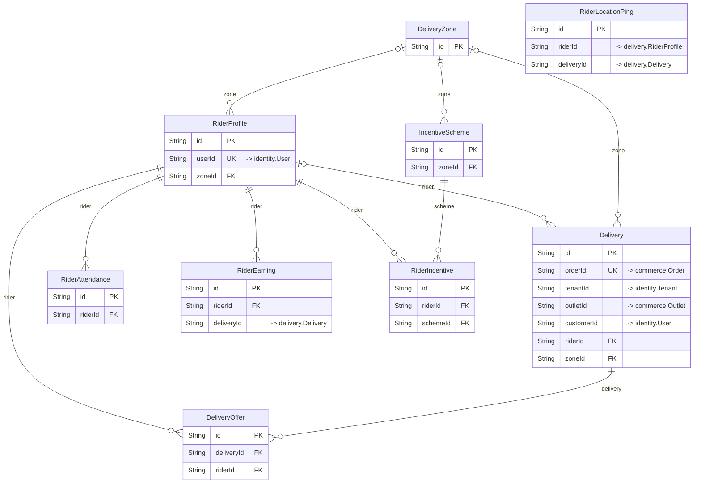

# `delivery` schema

Owner: delivery-service · 9 models · [all contexts](./README.md)

The diagram shows keys and relations; every column is listed in the reference below.

## Delivery

Table `delivery."Delivery"`

| Column | Type | Null | Default | Notes |
| --- | --- | :---: | --- | --- |
| `id` | String |  | cuid() | PK |
| `orderId` | String |  |  | unique; → commerce.Order |
| `orderNumber` | String |  |  |  |
| `tenantId` | String |  |  | → identity.Tenant |
| `outletId` | String |  |  | → commerce.Outlet |
| `customerId` | String | ✓ |  | → identity.User |
| `riderId` | String | ✓ |  |  |
| `zoneId` | String | ✓ |  |  |
| `status` | enum DeliveryStatus |  | UNASSIGNED |  |
| `pickupName` | String |  |  |  |
| `pickupAddress` | String |  |  |  |
| `pickupLat` | Float |  |  |  |
| `pickupLng` | Float |  |  |  |
| `pickupPhone` | String | ✓ |  |  |
| `dropName` | String | ✓ |  |  |
| `dropAddress` | String |  |  |  |
| `dropLat` | Float |  |  |  |
| `dropLng` | Float |  |  |  |
| `dropPhone` | String | ✓ |  |  |
| `distanceKm` | Float |  |  |  |
| `estimatedMins` | Int |  |  |  |
| `orderValue` | Decimal |  |  |  |
| `isCod` | Boolean |  | false |  |
| `codAmount` | Decimal |  | 0 |  |
| `tipAmount` | Decimal |  | 0 |  |
| `riderEarning` | Decimal |  | 0 |  |
| `surgeMultiplier` | Float |  | 1 |  |
| `deliveryOtp` | String | ✓ |  |  |
| `proofPhotoUrl` | String | ✓ |  |  |
| `proofSignatureUrl` | String | ✓ |  |  |
| `proofNote` | String | ✓ |  |  |
| `failureReason` | String | ✓ |  |  |
| `route` | Json | ✓ |  | Optimised route: ordered stops + polyline. |
| `batchId` | String | ✓ |  |  |
| `searchAttempts` | Int |  | 0 |  |
| `readyAt` | DateTime | ✓ |  |  |
| `assignedAt` | DateTime | ✓ |  |  |
| `arrivedPickupAt` | DateTime | ✓ |  |  |
| `pickedUpAt` | DateTime | ✓ |  |  |
| `arrivedDropAt` | DateTime | ✓ |  |  |
| `deliveredAt` | DateTime | ✓ |  |  |
| `cancelledAt` | DateTime | ✓ |  |  |
| `createdAt` | DateTime |  | now() |  |
| `updatedAt` | DateTime |  |  |  |

## DeliveryOffer

Table `delivery."DeliveryOffer"`

| Column | Type | Null | Default | Notes |
| --- | --- | :---: | --- | --- |
| `id` | String |  | cuid() | PK |
| `deliveryId` | String |  |  |  |
| `riderId` | String |  |  |  |
| `status` | enum OfferStatus |  | PENDING |  |
| `score` | Float |  |  |  |
| `distanceToPickupKm` | Float |  |  |  |
| `estimatedEarning` | Decimal |  |  |  |
| `offeredAt` | DateTime |  | now() |  |
| `expiresAt` | DateTime |  |  |  |
| `respondedAt` | DateTime | ✓ |  |  |
| `rejectReason` | String | ✓ |  |  |

## DeliveryZone

Table `delivery."DeliveryZone"`

| Column | Type | Null | Default | Notes |
| --- | --- | :---: | --- | --- |
| `id` | String |  | cuid() | PK |
| `name` | String |  |  |  |
| `city` | String |  |  |  |
| `polygon` | Json |  |  | GeoJSON Polygon coordinates: [[[lng, lat], ...]] |
| `centerLat` | Float |  |  |  |
| `centerLng` | Float |  |  |  |
| `baseFee` | Decimal |  |  |  |
| `perKmFee` | Decimal |  |  |  |
| `freeKm` | Float |  | 2 |  |
| `surgeMultiplier` | Float |  | 1 |  |
| `riderBasePay` | Decimal |  |  |  |
| `riderPerKm` | Decimal |  |  |  |
| `isActive` | Boolean |  | true |  |
| `createdAt` | DateTime |  | now() |  |
| `updatedAt` | DateTime |  |  |  |

## IncentiveScheme

Table `delivery."IncentiveScheme"`

| Column | Type | Null | Default | Notes |
| --- | --- | :---: | --- | --- |
| `id` | String |  | cuid() | PK |
| `name` | String |  |  |  |
| `description` | String | ✓ |  |  |
| `type` | enum IncentiveType |  |  |  |
| `zoneId` | String | ✓ |  |  |
| `city` | String | ✓ |  |  |
| `target` | Int |  |  |  |
| `rewardAmount` | Decimal |  |  |  |
| `peakWindows` | Json | ✓ |  | [{ "start": "12:00", "end": "14:30" }] for PEAK_HOURS schemes. |
| `minRating` | Float | ✓ |  |  |
| `startsAt` | DateTime |  |  |  |
| `endsAt` | DateTime |  |  |  |
| `isActive` | Boolean |  | true |  |
| `createdAt` | DateTime |  | now() |  |
| `updatedAt` | DateTime |  |  |  |

## RiderAttendance

Table `delivery."RiderAttendance"`

| Column | Type | Null | Default | Notes |
| --- | --- | :---: | --- | --- |
| `id` | String |  | cuid() | PK |
| `riderId` | String |  |  |  |
| `date` | DateTime |  |  |  |
| `status` | enum AttendanceStatus |  | PRESENT |  |
| `checkInAt` | DateTime | ✓ |  |  |
| `checkOutAt` | DateTime | ✓ |  |  |
| `checkInLat` | Float | ✓ |  |  |
| `checkInLng` | Float | ✓ |  |  |
| `onlineMinutes` | Int |  | 0 |  |
| `deliveryCount` | Int |  | 0 |  |
| `distanceKm` | Float |  | 0 |  |
| `createdAt` | DateTime |  | now() |  |
| `updatedAt` | DateTime |  |  |  |

Constraints: unique (riderId, date)

## RiderEarning

Table `delivery."RiderEarning"`

| Column | Type | Null | Default | Notes |
| --- | --- | :---: | --- | --- |
| `id` | String |  | cuid() | PK |
| `riderId` | String |  |  |  |
| `deliveryId` | String | ✓ |  | → delivery.Delivery |
| `type` | enum EarningType |  |  |  |
| `amount` | Decimal |  |  |  |
| `description` | String | ✓ |  |  |
| `earnedAt` | DateTime |  | now() |  |
| `settledAt` | DateTime | ✓ |  |  |
| `walletTxnId` | String | ✓ |  |  |

## RiderIncentive

Table `delivery."RiderIncentive"`

| Column | Type | Null | Default | Notes |
| --- | --- | :---: | --- | --- |
| `id` | String |  | cuid() | PK |
| `riderId` | String |  |  |  |
| `schemeId` | String |  |  |  |
| `progress` | Int |  | 0 |  |
| `target` | Int |  |  |  |
| `rewardAmount` | Decimal |  |  |  |
| `status` | enum IncentiveProgressStatus |  | IN_PROGRESS |  |
| `achievedAt` | DateTime | ✓ |  |  |
| `paidAt` | DateTime | ✓ |  |  |
| `createdAt` | DateTime |  | now() |  |
| `updatedAt` | DateTime |  |  |  |

Constraints: unique (riderId, schemeId)

## RiderLocationPing

Sampled GPS trail. Hot "current position" lives in Redis GEO; this table
keeps history for disputes, fraud checks and heat maps.

Table `delivery."RiderLocationPing"`

| Column | Type | Null | Default | Notes |
| --- | --- | :---: | --- | --- |
| `id` | String |  | cuid() | PK |
| `riderId` | String |  |  | → delivery.RiderProfile |
| `deliveryId` | String | ✓ |  | → delivery.Delivery |
| `lat` | Float |  |  |  |
| `lng` | Float |  |  |  |
| `accuracyM` | Float | ✓ |  |  |
| `speedKmph` | Float | ✓ |  |  |
| `heading` | Float | ✓ |  |  |
| `batteryPct` | Int | ✓ |  |  |
| `recordedAt` | DateTime |  | now() |  |

## RiderProfile

Table `delivery."RiderProfile"`

| Column | Type | Null | Default | Notes |
| --- | --- | :---: | --- | --- |
| `id` | String |  | cuid() | PK |
| `userId` | String |  |  | unique; → identity.User |
| `status` | enum RiderStatus |  | PENDING_APPROVAL |  |
| `name` | String |  |  |  |
| `phone` | String |  |  |  |
| `city` | String |  |  |  |
| `zoneId` | String | ✓ |  |  |
| `vehicleType` | enum VehicleType |  | MOTORCYCLE |  |
| `vehicleNumber` | String | ✓ |  |  |
| `licenseNumber` | String | ✓ |  |  |
| `aadhaarLast4` | String | ✓ |  |  |
| `documents` | Json |  | [] |  |
| `rating` | Float |  | 5 |  |
| `ratingCount` | Int |  | 0 |  |
| `isOnline` | Boolean |  | false |  |
| `isOnDelivery` | Boolean |  | false |  |
| `currentLat` | Float | ✓ |  |  |
| `currentLng` | Float | ✓ |  |  |
| `lastLocationAt` | DateTime | ✓ |  |  |
| `acceptanceRate` | Float |  | 1 |  |
| `totalDeliveries` | Int |  | 0 |  |
| `bankAccount` | Json | ✓ |  |  |
| `upiId` | String | ✓ |  |  |
| `approvedAt` | DateTime | ✓ |  |  |
| `approvedBy` | String | ✓ |  |  |
| `createdAt` | DateTime |  | now() |  |
| `updatedAt` | DateTime |  |  |  |
