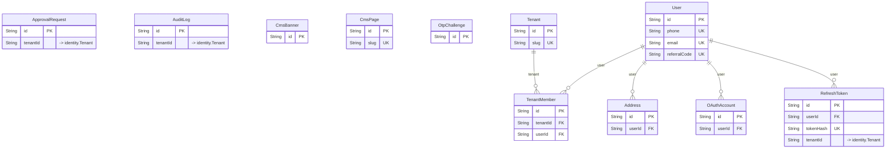

# `identity` schema

Owner: auth-service, user-service · 11 models · [all contexts](./README.md)

The diagram shows keys and relations; every column is listed in the reference below.

## Address

Table `identity."Address"`

| Column | Type | Null | Default | Notes |
| --- | --- | :---: | --- | --- |
| `id` | String |  | cuid() | PK |
| `userId` | String |  |  |  |
| `label` | String |  | Home |  |
| `contactName` | String | ✓ |  |  |
| `contactPhone` | String | ✓ |  |  |
| `line1` | String |  |  |  |
| `line2` | String | ✓ |  |  |
| `landmark` | String | ✓ |  |  |
| `city` | String |  |  |  |
| `state` | String |  |  |  |
| `pincode` | String |  |  |  |
| `lat` | Float |  |  |  |
| `lng` | Float |  |  |  |
| `isDefault` | Boolean |  | false |  |
| `createdAt` | DateTime |  | now() |  |
| `updatedAt` | DateTime |  |  |  |

## ApprovalRequest

Admin approval queue (restaurant / rider / supplier onboarding, ads ...).

Table `identity."ApprovalRequest"`

| Column | Type | Null | Default | Notes |
| --- | --- | :---: | --- | --- |
| `id` | String |  | cuid() | PK |
| `entityType` | enum ApprovalEntityType |  |  |  |
| `entityId` | String |  |  |  |
| `tenantId` | String | ✓ |  | → identity.Tenant |
| `title` | String |  |  |  |
| `submittedBy` | String | ✓ |  |  |
| `status` | enum ApprovalStatus |  | PENDING |  |
| `documents` | Json |  | [] |  |
| `metadata` | Json |  | {} |  |
| `reviewedBy` | String | ✓ |  |  |
| `reviewedAt` | DateTime | ✓ |  |  |
| `reviewNotes` | String | ✓ |  |  |
| `createdAt` | DateTime |  | now() |  |
| `updatedAt` | DateTime |  |  |  |

## AuditLog

Table `identity."AuditLog"`

| Column | Type | Null | Default | Notes |
| --- | --- | :---: | --- | --- |
| `id` | String |  | cuid() | PK |
| `actorId` | String | ✓ |  |  |
| `tenantId` | String | ✓ |  | → identity.Tenant |
| `action` | String |  |  |  |
| `entityType` | String |  |  |  |
| `entityId` | String | ✓ |  |  |
| `changes` | Json | ✓ |  |  |
| `ip` | String | ✓ |  |  |
| `userAgent` | String | ✓ |  |  |
| `createdAt` | DateTime |  | now() |  |

## CmsBanner

Table `identity."CmsBanner"`

| Column | Type | Null | Default | Notes |
| --- | --- | :---: | --- | --- |
| `id` | String |  | cuid() | PK |
| `title` | String |  |  |  |
| `subtitle` | String | ✓ |  |  |
| `imageUrl` | String |  |  |  |
| `linkUrl` | String | ✓ |  |  |
| `placement` | String |  |  |  |
| `audience` | enum Audience |  | CUSTOMER |  |
| `cities` | String[] |  | [] |  |
| `sortOrder` | Int |  | 0 |  |
| `startsAt` | DateTime | ✓ |  |  |
| `endsAt` | DateTime | ✓ |  |  |
| `isActive` | Boolean |  | true |  |
| `createdAt` | DateTime |  | now() |  |
| `updatedAt` | DateTime |  |  |  |

## CmsPage

Table `identity."CmsPage"`

| Column | Type | Null | Default | Notes |
| --- | --- | :---: | --- | --- |
| `id` | String |  | cuid() | PK |
| `slug` | String |  |  | unique |
| `title` | String |  |  |  |
| `body` | String |  |  |  |
| `status` | enum ContentStatus |  | DRAFT |  |
| `audience` | enum Audience |  | ALL |  |
| `seoTitle` | String | ✓ |  |  |
| `seoDescription` | String | ✓ |  |  |
| `publishedAt` | DateTime | ✓ |  |  |
| `updatedBy` | String | ✓ |  |  |
| `createdAt` | DateTime |  | now() |  |
| `updatedAt` | DateTime |  |  |  |

## OAuthAccount

Table `identity."OAuthAccount"`

| Column | Type | Null | Default | Notes |
| --- | --- | :---: | --- | --- |
| `id` | String |  | cuid() | PK |
| `userId` | String |  |  |  |
| `provider` | enum OAuthProvider |  |  |  |
| `providerAccountId` | String |  |  |  |
| `email` | String | ✓ |  |  |
| `createdAt` | DateTime |  | now() |  |

Constraints: unique (provider, providerAccountId)

## OtpChallenge

Table `identity."OtpChallenge"`

| Column | Type | Null | Default | Notes |
| --- | --- | :---: | --- | --- |
| `id` | String |  | cuid() | PK |
| `phone` | String |  |  |  |
| `purpose` | enum OtpPurpose |  | LOGIN |  |
| `codeHash` | String |  |  |  |
| `attempts` | Int |  | 0 |  |
| `maxAttempts` | Int |  | 5 |  |
| `expiresAt` | DateTime |  |  |  |
| `consumedAt` | DateTime | ✓ |  |  |
| `ip` | String | ✓ |  |  |
| `createdAt` | DateTime |  | now() |  |

## RefreshToken

Opaque refresh tokens with rotation + reuse detection (token families).

Table `identity."RefreshToken"`

| Column | Type | Null | Default | Notes |
| --- | --- | :---: | --- | --- |
| `id` | String |  | cuid() | PK |
| `userId` | String |  |  |  |
| `tokenHash` | String |  |  | unique |
| `familyId` | String |  |  |  |
| `tenantId` | String | ✓ |  | → identity.Tenant |
| `deviceId` | String | ✓ |  |  |
| `userAgent` | String | ✓ |  |  |
| `ip` | String | ✓ |  |  |
| `expiresAt` | DateTime |  |  |  |
| `revokedAt` | DateTime | ✓ |  |  |
| `revokedReason` | String | ✓ |  |  |
| `replacedById` | String | ✓ |  |  |
| `createdAt` | DateTime |  | now() |  |

## Tenant

A business organisation on the platform. Every merchant-side record is
partitioned by tenantId.

Table `identity."Tenant"`

| Column | Type | Null | Default | Notes |
| --- | --- | :---: | --- | --- |
| `id` | String |  | cuid() | PK |
| `type` | enum TenantType |  |  |  |
| `status` | enum TenantStatus |  | PENDING_APPROVAL |  |
| `name` | String |  |  |  |
| `slug` | String |  |  | unique |
| `legalName` | String | ✓ |  |  |
| `gstin` | String | ✓ |  |  |
| `pan` | String | ✓ |  |  |
| `fssaiLicense` | String | ✓ |  |  |
| `email` | String | ✓ |  |  |
| `phone` | String | ✓ |  |  |
| `addressLine1` | String | ✓ |  |  |
| `city` | String | ✓ |  |  |
| `state` | String | ✓ |  |  |
| `stateCode` | String | ✓ |  | GST state code (e.g. "29" Karnataka) used for CGST/SGST vs IGST. |
| `pincode` | String | ✓ |  |  |
| `lat` | Float | ✓ |  |  |
| `lng` | Float | ✓ |  |  |
| `logoUrl` | String | ✓ |  |  |
| `settings` | Json |  | {} |  |
| `kycDocuments` | Json |  | [] |  |
| `approvedAt` | DateTime | ✓ |  |  |
| `approvedBy` | String | ✓ |  |  |
| `rejectionReason` | String | ✓ |  |  |
| `createdAt` | DateTime |  | now() |  |
| `updatedAt` | DateTime |  |  |  |

## TenantMember

Table `identity."TenantMember"`

| Column | Type | Null | Default | Notes |
| --- | --- | :---: | --- | --- |
| `id` | String |  | cuid() | PK |
| `tenantId` | String |  |  |  |
| `userId` | String |  |  |  |
| `role` | enum TenantRole |  |  |  |
| `status` | enum TenantMemberStatus |  | ACTIVE |  |
| `outletIds` | String[] |  | [] | Empty = access to every outlet of the tenant. |
| `title` | String | ✓ |  |  |
| `invitedBy` | String | ✓ |  |  |
| `createdAt` | DateTime |  | now() |  |
| `updatedAt` | DateTime |  |  |  |

Constraints: unique (tenantId, userId)

## User

Table `identity."User"`

| Column | Type | Null | Default | Notes |
| --- | --- | :---: | --- | --- |
| `id` | String |  | cuid() | PK |
| `phone` | String | ✓ |  | unique |
| `email` | String | ✓ |  | unique |
| `name` | String | ✓ |  |  |
| `avatarUrl` | String | ✓ |  |  |
| `passwordHash` | String | ✓ |  |  |
| `roles` | enum PlatformRole[] |  | [CUSTOMER] |  |
| `status` | enum UserStatus |  | ACTIVE |  |
| `phoneVerifiedAt` | DateTime | ✓ |  |  |
| `emailVerifiedAt` | DateTime | ✓ |  |  |
| `referralCode` | String | ✓ |  | unique |
| `referredBy` | String | ✓ |  |  |
| `preferences` | Json |  | {} |  |
| `lastLoginAt` | DateTime | ✓ |  |  |
| `createdAt` | DateTime |  | now() |  |
| `updatedAt` | DateTime |  |  |  |
