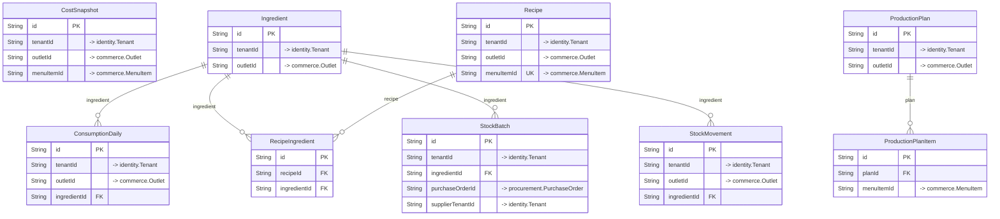

# `inventory` schema

Owner: inventory-service · 9 models · [all contexts](./README.md)

The diagram shows keys and relations; every column is listed in the reference below.

## ConsumptionDaily

Daily roll-up of consumption — the training series for demand forecasting.

Table `inventory."ConsumptionDaily"`

| Column | Type | Null | Default | Notes |
| --- | --- | :---: | --- | --- |
| `id` | String |  | cuid() | PK |
| `tenantId` | String |  |  | → identity.Tenant |
| `outletId` | String |  |  | → commerce.Outlet |
| `ingredientId` | String |  |  |  |
| `date` | DateTime |  |  |  |
| `consumedQty` | Decimal |  |  |  |
| `wastedQty` | Decimal |  | 0 |  |
| `ordersCount` | Int |  | 0 |  |

Constraints: unique (ingredientId, date)

## CostSnapshot

Daily food-cost snapshot per menu item (theoretical cost from recipe).

Table `inventory."CostSnapshot"`

| Column | Type | Null | Default | Notes |
| --- | --- | :---: | --- | --- |
| `id` | String |  | cuid() | PK |
| `tenantId` | String |  |  | → identity.Tenant |
| `outletId` | String |  |  | → commerce.Outlet |
| `menuItemId` | String |  |  | → commerce.MenuItem |
| `date` | DateTime |  |  |  |
| `sellingPrice` | Decimal |  |  |  |
| `foodCost` | Decimal |  |  |  |
| `packagingCost` | Decimal |  | 0 |  |
| `foodCostPct` | Decimal |  |  |  |
| `marginPct` | Decimal |  |  |  |
| `createdAt` | DateTime |  | now() |  |

Constraints: unique (menuItemId, date)

## Ingredient

Table `inventory."Ingredient"`

| Column | Type | Null | Default | Notes |
| --- | --- | :---: | --- | --- |
| `id` | String |  | cuid() | PK |
| `tenantId` | String |  |  | → identity.Tenant |
| `outletId` | String |  |  | → commerce.Outlet |
| `name` | String |  |  |  |
| `sku` | String |  |  |  |
| `category` | enum IngredientCategory |  |  |  |
| `unit` | enum StockUnit |  |  |  |
| `currentStock` | Decimal |  | 0 |  |
| `reorderLevel` | Decimal |  | 0 |  |
| `reorderQty` | Decimal |  | 0 |  |
| `safetyStock` | Decimal |  | 0 |  |
| `maxStock` | Decimal | ✓ |  |  |
| `avgUnitCost` | Decimal |  | 0 | Weighted average cost per unit (moving average on every receipt). |
| `lastPurchasePrice` | Decimal | ✓ |  |  |
| `shelfLifeDays` | Int | ✓ |  |  |
| `storageType` | enum StorageType |  | DRY |  |
| `isPerishable` | Boolean |  | false |  |
| `leadTimeDays` | Int |  | 2 |  |
| `preferredSupplierId` | String | ✓ |  |  |
| `marketplaceCategory` | String | ✓ |  | Link to the B2B marketplace product category for procurement matching. |
| `marketplaceProductId` | String | ✓ |  |  |
| `isActive` | Boolean |  | true |  |
| `createdAt` | DateTime |  | now() |  |
| `updatedAt` | DateTime |  |  |  |

Constraints: unique (outletId, sku)

## ProductionPlan

Table `inventory."ProductionPlan"`

| Column | Type | Null | Default | Notes |
| --- | --- | :---: | --- | --- |
| `id` | String |  | cuid() | PK |
| `tenantId` | String |  |  | → identity.Tenant |
| `outletId` | String |  |  | → commerce.Outlet |
| `planDate` | DateTime |  |  |  |
| `status` | enum ProductionPlanStatus |  | DRAFT |  |
| `notes` | String | ✓ |  |  |
| `createdBy` | String | ✓ |  |  |
| `createdAt` | DateTime |  | now() |  |
| `updatedAt` | DateTime |  |  |  |

Constraints: unique (outletId, planDate)

## ProductionPlanItem

Table `inventory."ProductionPlanItem"`

| Column | Type | Null | Default | Notes |
| --- | --- | :---: | --- | --- |
| `id` | String |  | cuid() | PK |
| `planId` | String |  |  |  |
| `menuItemId` | String |  |  | → commerce.MenuItem |
| `recipeId` | String | ✓ |  |  |
| `name` | String |  |  |  |
| `forecastQty` | Decimal |  |  |  |
| `plannedQty` | Decimal |  |  |  |
| `producedQty` | Decimal |  | 0 |  |

## Recipe

Bill of materials for one menu item (per 1 portion unless yieldQty > 1).

Table `inventory."Recipe"`

| Column | Type | Null | Default | Notes |
| --- | --- | :---: | --- | --- |
| `id` | String |  | cuid() | PK |
| `tenantId` | String |  |  | → identity.Tenant |
| `outletId` | String |  |  | → commerce.Outlet |
| `menuItemId` | String |  |  | unique; → commerce.MenuItem |
| `name` | String |  |  |  |
| `yieldQty` | Decimal |  | 1 |  |
| `yieldUnit` | enum StockUnit |  | PCS |  |
| `prepTimeMins` | Int | ✓ |  |  |
| `instructions` | String | ✓ |  |  |
| `isActive` | Boolean |  | true |  |
| `createdAt` | DateTime |  | now() |  |
| `updatedAt` | DateTime |  |  |  |

## RecipeIngredient

Table `inventory."RecipeIngredient"`

| Column | Type | Null | Default | Notes |
| --- | --- | :---: | --- | --- |
| `id` | String |  | cuid() | PK |
| `recipeId` | String |  |  |  |
| `ingredientId` | String |  |  |  |
| `quantity` | Decimal |  |  | Quantity expressed in `unit`; converted to the ingredient's unit at use. |
| `unit` | enum StockUnit |  |  |  |
| `wastagePct` | Decimal |  | 0 |  |

Constraints: unique (recipeId, ingredientId)

## StockBatch

Table `inventory."StockBatch"`

| Column | Type | Null | Default | Notes |
| --- | --- | :---: | --- | --- |
| `id` | String |  | cuid() | PK |
| `tenantId` | String |  |  | → identity.Tenant |
| `ingredientId` | String |  |  |  |
| `batchNumber` | String | ✓ |  |  |
| `quantity` | Decimal |  |  |  |
| `remainingQty` | Decimal |  |  |  |
| `unitCost` | Decimal |  |  |  |
| `receivedAt` | DateTime |  | now() |  |
| `expiresAt` | DateTime | ✓ |  |  |
| `purchaseOrderId` | String | ✓ |  | → procurement.PurchaseOrder |
| `supplierTenantId` | String | ✓ |  | → identity.Tenant |
| `createdAt` | DateTime |  | now() |  |

## StockMovement

Immutable stock ledger. quantity is signed (+in / -out).

Table `inventory."StockMovement"`

| Column | Type | Null | Default | Notes |
| --- | --- | :---: | --- | --- |
| `id` | String |  | cuid() | PK |
| `tenantId` | String |  |  | → identity.Tenant |
| `outletId` | String |  |  | → commerce.Outlet |
| `ingredientId` | String |  |  |  |
| `type` | enum StockMovementType |  |  |  |
| `quantity` | Decimal |  |  |  |
| `unitCost` | Decimal | ✓ |  |  |
| `totalCost` | Decimal | ✓ |  |  |
| `balanceAfter` | Decimal |  |  |  |
| `referenceType` | String | ✓ |  |  |
| `referenceId` | String | ✓ |  |  |
| `reason` | String | ✓ |  |  |
| `createdBy` | String | ✓ |  |  |
| `createdAt` | DateTime |  | now() |  |
