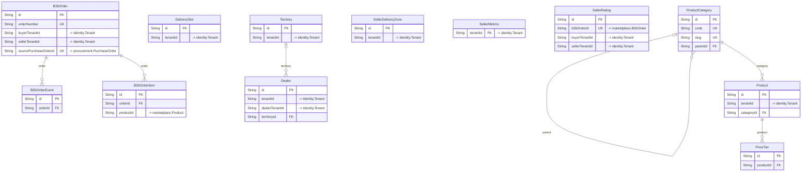

# `marketplace` schema

Owner: supplier-service · 12 models · [all contexts](./README.md)

The diagram shows keys and relations; every column is listed in the reference below.

## B2bOrder

Table `marketplace."B2bOrder"`

| Column | Type | Null | Default | Notes |
| --- | --- | :---: | --- | --- |
| `id` | String |  | cuid() | PK |
| `orderNumber` | String |  |  | unique |
| `buyerTenantId` | String |  |  | → identity.Tenant |
| `buyerName` | String |  |  |  |
| `sellerTenantId` | String |  |  | → identity.Tenant |
| `sellerName` | String |  |  |  |
| `sourcePurchaseOrderId` | String | ✓ |  | unique; → procurement.PurchaseOrder |
| `status` | enum B2bOrderStatus |  | PLACED |  |
| `subtotal` | Decimal |  |  |  |
| `discount` | Decimal |  | 0 |  |
| `taxTotal` | Decimal |  |  |  |
| `deliveryCharge` | Decimal |  | 0 |  |
| `total` | Decimal |  |  |  |
| `paymentTerms` | enum PaymentTerms |  | PREPAID |  |
| `paymentStatus` | enum B2bPaymentStatus |  | PENDING |  |
| `deliverySlotId` | String | ✓ |  |  |
| `deliveryDate` | DateTime | ✓ |  |  |
| `deliveryAddress` | Json |  |  |  |
| `expectedDeliveryAt` | DateTime | ✓ |  |  |
| `trackingInfo` | Json | ✓ |  |  |
| `notes` | String | ✓ |  |  |
| `rejectionReason` | String | ✓ |  |  |
| `confirmedAt` | DateTime | ✓ |  |  |
| `packedAt` | DateTime | ✓ |  |  |
| `dispatchedAt` | DateTime | ✓ |  |  |
| `deliveredAt` | DateTime | ✓ |  |  |
| `cancelledAt` | DateTime | ✓ |  |  |
| `createdAt` | DateTime |  | now() |  |
| `updatedAt` | DateTime |  |  |  |

## B2bOrderEvent

Table `marketplace."B2bOrderEvent"`

| Column | Type | Null | Default | Notes |
| --- | --- | :---: | --- | --- |
| `id` | String |  | cuid() | PK |
| `orderId` | String |  |  |  |
| `status` | enum B2bOrderStatus |  |  |  |
| `note` | String | ✓ |  |  |
| `lat` | Float | ✓ |  |  |
| `lng` | Float | ✓ |  |  |
| `actorId` | String | ✓ |  |  |
| `createdAt` | DateTime |  | now() |  |

## B2bOrderItem

Table `marketplace."B2bOrderItem"`

| Column | Type | Null | Default | Notes |
| --- | --- | :---: | --- | --- |
| `id` | String |  | cuid() | PK |
| `orderId` | String |  |  |  |
| `productId` | String |  |  | → marketplace.Product |
| `name` | String |  |  |  |
| `sku` | String |  |  |  |
| `quantity` | Decimal |  |  |  |
| `unit` | String |  |  |  |
| `unitPrice` | Decimal |  |  |  |
| `gstRate` | Decimal |  |  |  |
| `taxAmount` | Decimal |  |  |  |
| `lineTotal` | Decimal |  |  |  |
| `confirmedQty` | Decimal | ✓ |  |  |

## Dealer

Table `marketplace."Dealer"`

| Column | Type | Null | Default | Notes |
| --- | --- | :---: | --- | --- |
| `id` | String |  | cuid() | PK |
| `tenantId` | String |  |  | → identity.Tenant |
| `dealerTenantId` | String | ✓ |  | → identity.Tenant; The dealer's own organisation, if it is on the platform. |
| `name` | String |  |  |  |
| `contactName` | String | ✓ |  |  |
| `phone` | String |  |  |  |
| `email` | String | ✓ |  |  |
| `gstin` | String | ✓ |  |  |
| `address` | String | ✓ |  |  |
| `city` | String |  |  |  |
| `territoryId` | String | ✓ |  |  |
| `tier` | enum DealerTier |  | BRONZE |  |
| `status` | enum DealerStatus |  | PROSPECT |  |
| `creditLimit` | Decimal |  | 0 |  |
| `outstanding` | Decimal |  | 0 |  |
| `paymentTerms` | enum PaymentTerms |  | PREPAID |  |
| `discountPct` | Decimal |  | 0 |  |
| `onboardedAt` | DateTime | ✓ |  |  |
| `createdAt` | DateTime |  | now() |  |
| `updatedAt` | DateTime |  |  |  |

Constraints: unique (tenantId, phone)

## DeliverySlot

Table `marketplace."DeliverySlot"`

| Column | Type | Null | Default | Notes |
| --- | --- | :---: | --- | --- |
| `id` | String |  | cuid() | PK |
| `tenantId` | String |  |  | → identity.Tenant |
| `label` | String | ✓ |  |  |
| `dayOfWeek` | Int |  |  | 0 = Sunday ... 6 = Saturday |
| `startTime` | String |  |  |  |
| `endTime` | String |  |  |  |
| `capacity` | Int |  |  |  |
| `cutoffMinutes` | Int |  | 120 |  |
| `isActive` | Boolean |  | true |  |
| `createdAt` | DateTime |  | now() |  |

## PriceTier

Bulk / segment pricing: the highest minQty tier <= ordered qty applies.

Table `marketplace."PriceTier"`

| Column | Type | Null | Default | Notes |
| --- | --- | :---: | --- | --- |
| `id` | String |  | cuid() | PK |
| `productId` | String |  |  |  |
| `minQty` | Decimal |  |  |  |
| `maxQty` | Decimal | ✓ |  |  |
| `unitPrice` | Decimal |  |  |  |
| `segment` | enum BuyerSegment |  | ALL |  |
| `validFrom` | DateTime | ✓ |  |  |
| `validTo` | DateTime | ✓ |  |  |

## Product

Table `marketplace."Product"`

| Column | Type | Null | Default | Notes |
| --- | --- | :---: | --- | --- |
| `id` | String |  | cuid() | PK |
| `tenantId` | String |  |  | → identity.Tenant |
| `sellerType` | enum SellerType |  |  |  |
| `categoryId` | String |  |  |  |
| `name` | String |  |  |  |
| `slug` | String |  |  |  |
| `sku` | String |  |  |  |
| `brand` | String | ✓ |  |  |
| `description` | String | ✓ |  |  |
| `images` | String[] |  | [] |  |
| `unit` | enum StockUnit |  |  |  |
| `packSize` | Decimal |  | 1 | Quantity of `unit` contained in one sellable pack (e.g. 25 KG bag). |
| `price` | Decimal |  |  | Base price per pack (pre-tax). Bulk tiers override this. |
| `mrp` | Decimal | ✓ |  |  |
| `moq` | Decimal |  | 1 |  |
| `maxOrderQty` | Decimal | ✓ |  |  |
| `stepQty` | Decimal |  | 1 |  |
| `gstRate` | Decimal |  |  |  |
| `hsnCode` | String | ✓ |  |  |
| `deliveryTimeHours` | Int |  | 24 |  |
| `stockQty` | Decimal |  | 0 |  |
| `lowStockThreshold` | Decimal |  | 10 |  |
| `stockStatus` | enum StockStatus |  | IN_STOCK |  |
| `isActive` | Boolean |  | true |  |
| `rating` | Float |  | 0 |  |
| `ratingCount` | Int |  | 0 |  |
| `attributes` | Json |  | {} |  |
| `tags` | String[] |  | [] |  |
| `createdAt` | DateTime |  | now() |  |
| `updatedAt` | DateTime |  |  |  |

Constraints: unique (tenantId, sku)

## ProductCategory

Dairy, Flour, Sugar, Rice, Vegetables, Fruits, Packaging, Spices,
Beverages, Frozen ... (seeded).

Table `marketplace."ProductCategory"`

| Column | Type | Null | Default | Notes |
| --- | --- | :---: | --- | --- |
| `id` | String |  | cuid() | PK |
| `code` | String |  |  | unique |
| `name` | String |  |  |  |
| `slug` | String |  |  | unique |
| `parentId` | String | ✓ |  |  |
| `imageUrl` | String | ✓ |  |  |
| `sortOrder` | Int |  | 0 |  |
| `isActive` | Boolean |  | true |  |

## SellerDeliveryZone

Table `marketplace."SellerDeliveryZone"`

| Column | Type | Null | Default | Notes |
| --- | --- | :---: | --- | --- |
| `id` | String |  | cuid() | PK |
| `tenantId` | String |  |  | → identity.Tenant |
| `name` | String |  |  |  |
| `pincodes` | String[] |  | [] |  |
| `centerLat` | Float | ✓ |  |  |
| `centerLng` | Float | ✓ |  |  |
| `radiusKm` | Float | ✓ |  |  |
| `deliveryCharge` | Decimal |  |  |  |
| `freeDeliveryAbove` | Decimal | ✓ |  |  |
| `minOrderValue` | Decimal |  | 0 |  |
| `leadTimeHours` | Int |  | 24 |  |
| `isActive` | Boolean |  | true |  |
| `createdAt` | DateTime |  | now() |  |
| `updatedAt` | DateTime |  |  |  |

## SellerMetrics

Denormalised seller KPIs consumed by the supplier recommendation engine.

Table `marketplace."SellerMetrics"`

| Column | Type | Null | Default | Notes |
| --- | --- | :---: | --- | --- |
| `tenantId` | String |  |  | PK; → identity.Tenant |
| `sellerName` | String |  |  |  |
| `avgRating` | Float |  | 0 |  |
| `ratingCount` | Int |  | 0 |  |
| `onTimeRate` | Float |  | 1 |  |
| `fillRate` | Float |  | 1 |  |
| `avgLeadTimeHours` | Float |  | 24 |  |
| `totalOrders` | Int |  | 0 |  |
| `updatedAt` | DateTime |  |  |  |

## SellerRating

Table `marketplace."SellerRating"`

| Column | Type | Null | Default | Notes |
| --- | --- | :---: | --- | --- |
| `id` | String |  | cuid() | PK |
| `b2bOrderId` | String |  |  | unique; → marketplace.B2bOrder |
| `buyerTenantId` | String |  |  | → identity.Tenant |
| `sellerTenantId` | String |  |  | → identity.Tenant |
| `rating` | Int |  |  |  |
| `qualityRating` | Int | ✓ |  |  |
| `onTime` | Boolean |  |  |  |
| `comment` | String | ✓ |  |  |
| `createdAt` | DateTime |  | now() |  |

## Territory

Table `marketplace."Territory"`

| Column | Type | Null | Default | Notes |
| --- | --- | :---: | --- | --- |
| `id` | String |  | cuid() | PK |
| `tenantId` | String |  |  | → identity.Tenant |
| `name` | String |  |  |  |
| `code` | String | ✓ |  |  |
| `states` | String[] |  | [] |  |
| `cities` | String[] |  | [] |  |
| `pincodes` | String[] |  | [] |  |
| `managerUserId` | String | ✓ |  |  |
| `monthlyTarget` | Decimal | ✓ |  |  |
| `isActive` | Boolean |  | true |  |
| `createdAt` | DateTime |  | now() |  |
| `updatedAt` | DateTime |  |  |  |
