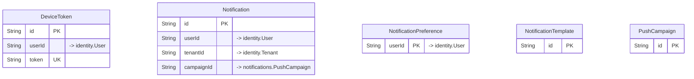

# `notifications` schema

Owner: notification-service · 5 models · [all contexts](./README.md)

The diagram shows keys and relations; every column is listed in the reference below.

## DeviceToken

Table `notifications."DeviceToken"`

| Column | Type | Null | Default | Notes |
| --- | --- | :---: | --- | --- |
| `id` | String |  | cuid() | PK |
| `userId` | String |  |  | → identity.User |
| `token` | String |  |  | unique |
| `platform` | enum DevicePlatform |  |  |  |
| `app` | enum AppKind |  |  |  |
| `isActive` | Boolean |  | true |  |
| `lastSeenAt` | DateTime |  | now() |  |
| `createdAt` | DateTime |  | now() |  |

## Notification

Table `notifications."Notification"`

| Column | Type | Null | Default | Notes |
| --- | --- | :---: | --- | --- |
| `id` | String |  | cuid() | PK |
| `userId` | String | ✓ |  | → identity.User |
| `tenantId` | String | ✓ |  | → identity.Tenant |
| `recipient` | String |  |  |  |
| `channel` | enum NotificationChannel |  |  |  |
| `templateKey` | String | ✓ |  |  |
| `title` | String | ✓ |  |  |
| `body` | String |  |  |  |
| `data` | Json |  | {} |  |
| `status` | enum NotificationStatus |  | QUEUED |  |
| `provider` | String | ✓ |  |  |
| `providerMessageId` | String | ✓ |  |  |
| `error` | String | ✓ |  |  |
| `attempts` | Int |  | 0 |  |
| `campaignId` | String | ✓ |  | → notifications.PushCampaign |
| `sentAt` | DateTime | ✓ |  |  |
| `readAt` | DateTime | ✓ |  |  |
| `createdAt` | DateTime |  | now() |  |

## NotificationPreference

Table `notifications."NotificationPreference"`

| Column | Type | Null | Default | Notes |
| --- | --- | :---: | --- | --- |
| `userId` | String |  |  | PK; → identity.User |
| `pushEnabled` | Boolean |  | true |  |
| `smsEnabled` | Boolean |  | true |  |
| `emailEnabled` | Boolean |  | true |  |
| `marketingEnabled` | Boolean |  | true |  |
| `quietHoursStart` | String | ✓ |  |  |
| `quietHoursEnd` | String | ✓ |  |  |
| `updatedAt` | DateTime |  |  |  |

## NotificationTemplate

Table `notifications."NotificationTemplate"`

| Column | Type | Null | Default | Notes |
| --- | --- | :---: | --- | --- |
| `id` | String |  | cuid() | PK |
| `key` | String |  |  |  |
| `channel` | enum NotificationChannel |  |  |  |
| `locale` | String |  | en |  |
| `title` | String | ✓ |  |  |
| `body` | String |  |  | Mustache-style placeholders: "Order {{orderNumber}} is on the way" |
| `isActive` | Boolean |  | true |  |
| `createdAt` | DateTime |  | now() |  |
| `updatedAt` | DateTime |  |  |  |

Constraints: unique (key, channel, locale)

## PushCampaign

Table `notifications."PushCampaign"`

| Column | Type | Null | Default | Notes |
| --- | --- | :---: | --- | --- |
| `id` | String |  | cuid() | PK |
| `title` | String |  |  |  |
| `body` | String |  |  |  |
| `imageUrl` | String | ✓ |  |  |
| `deepLink` | String | ✓ |  |  |
| `app` | enum AppKind |  |  |  |
| `audience` | Json |  | {} | { "cities": [...], "inactiveDays": 30, "segment": "MEMBERS" } |
| `status` | enum PushCampaignStatus |  | DRAFT |  |
| `scheduledAt` | DateTime | ✓ |  |  |
| `sentAt` | DateTime | ✓ |  |  |
| `targetCount` | Int |  | 0 |  |
| `sentCount` | Int |  | 0 |  |
| `failedCount` | Int |  | 0 |  |
| `openCount` | Int |  | 0 |  |
| `createdBy` | String |  |  |  |
| `createdAt` | DateTime |  | now() |  |
| `updatedAt` | DateTime |  |  |  |
