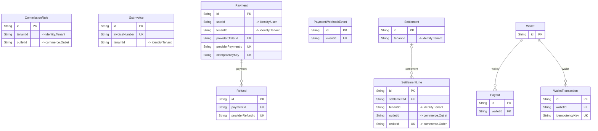

# `payments` schema

Owner: payment-service · 10 models · [all contexts](./README.md)

The diagram shows keys and relations; every column is listed in the reference below.

## CommissionRule

Commission rules. The most specific active rule wins
(outlet > tenant > tenantType > default) and then by priority.

Table `payments."CommissionRule"`

| Column | Type | Null | Default | Notes |
| --- | --- | :---: | --- | --- |
| `id` | String |  | cuid() | PK |
| `name` | String |  |  |  |
| `tenantType` | enum TenantType | ✓ |  |  |
| `tenantId` | String | ✓ |  | → identity.Tenant |
| `outletId` | String | ✓ |  | → commerce.Outlet |
| `ratePct` | Decimal |  |  |  |
| `fixedFee` | Decimal |  | 0 |  |
| `minFee` | Decimal | ✓ |  |  |
| `maxFee` | Decimal | ✓ |  |  |
| `priority` | Int |  | 0 |  |
| `effectiveFrom` | DateTime |  | now() |  |
| `effectiveTo` | DateTime | ✓ |  |  |
| `isActive` | Boolean |  | true |  |
| `createdAt` | DateTime |  | now() |  |
| `updatedAt` | DateTime |  |  |  |

## GstInvoice

Table `payments."GstInvoice"`

| Column | Type | Null | Default | Notes |
| --- | --- | :---: | --- | --- |
| `id` | String |  | cuid() | PK |
| `invoiceNumber` | String |  |  | unique |
| `type` | enum InvoiceType |  |  |  |
| `referenceId` | String |  |  |  |
| `tenantId` | String | ✓ |  | → identity.Tenant |
| `supplierName` | String |  |  |  |
| `supplierGstin` | String | ✓ |  |  |
| `supplierStateCode` | String |  |  |  |
| `recipientName` | String | ✓ |  |  |
| `recipientGstin` | String | ✓ |  |  |
| `placeOfSupply` | String |  |  |  |
| `isInterState` | Boolean |  |  |  |
| `hsnSac` | String |  |  |  |
| `taxableValue` | Decimal |  |  |  |
| `cgst` | Decimal |  | 0 |  |
| `sgst` | Decimal |  | 0 |  |
| `igst` | Decimal |  | 0 |  |
| `cess` | Decimal |  | 0 |  |
| `total` | Decimal |  |  |  |
| `issuedAt` | DateTime |  | now() |  |
| `pdfUrl` | String | ✓ |  |  |

## Payment

Table `payments."Payment"`

| Column | Type | Null | Default | Notes |
| --- | --- | :---: | --- | --- |
| `id` | String |  | cuid() | PK |
| `purpose` | enum PaymentPurpose |  |  |  |
| `referenceId` | String |  |  |  |
| `userId` | String | ✓ |  | → identity.User |
| `tenantId` | String | ✓ |  | → identity.Tenant |
| `amount` | Decimal |  |  |  |
| `currency` | String |  | INR |  |
| `method` | enum PaymentMethod | ✓ |  |  |
| `provider` | enum PaymentProvider |  |  |  |
| `state` | enum PaymentState |  | CREATED |  |
| `providerOrderId` | String | ✓ |  | unique |
| `providerPaymentId` | String | ✓ |  | unique |
| `providerSignature` | String | ✓ |  |  |
| `failureCode` | String | ✓ |  |  |
| `failureReason` | String | ✓ |  |  |
| `idempotencyKey` | String | ✓ |  | unique |
| `refundedAmount` | Decimal |  | 0 |  |
| `capturedAt` | DateTime | ✓ |  |  |
| `metadata` | Json |  | {} |  |
| `createdAt` | DateTime |  | now() |  |
| `updatedAt` | DateTime |  |  |  |

## PaymentWebhookEvent

Raw gateway webhooks, stored for idempotent processing and audit.

Table `payments."PaymentWebhookEvent"`

| Column | Type | Null | Default | Notes |
| --- | --- | :---: | --- | --- |
| `id` | String |  | cuid() | PK |
| `provider` | enum PaymentProvider |  |  |  |
| `eventId` | String |  |  | unique |
| `eventType` | String |  |  |  |
| `payload` | Json |  |  |  |
| `signatureValid` | Boolean |  |  |  |
| `processedAt` | DateTime | ✓ |  |  |
| `error` | String | ✓ |  |  |
| `receivedAt` | DateTime |  | now() |  |

## Payout

Table `payments."Payout"`

| Column | Type | Null | Default | Notes |
| --- | --- | :---: | --- | --- |
| `id` | String |  | cuid() | PK |
| `walletId` | String |  |  |  |
| `ownerType` | enum WalletOwnerType |  |  |  |
| `ownerId` | String |  |  |  |
| `amount` | Decimal |  |  |  |
| `status` | enum PayoutStatus |  | REQUESTED |  |
| `method` | String |  | UPI |  |
| `destination` | Json |  |  |  |
| `utr` | String | ✓ |  |  |
| `failureReason` | String | ✓ |  |  |
| `requestedAt` | DateTime |  | now() |  |
| `processedAt` | DateTime | ✓ |  |  |

## Refund

Table `payments."Refund"`

| Column | Type | Null | Default | Notes |
| --- | --- | :---: | --- | --- |
| `id` | String |  | cuid() | PK |
| `paymentId` | String |  |  |  |
| `amount` | Decimal |  |  |  |
| `reason` | String |  |  |  |
| `status` | enum RefundStatus |  | PENDING |  |
| `toWallet` | Boolean |  | false | Refund to the original instrument or to the platform wallet. |
| `providerRefundId` | String | ✓ |  | unique |
| `initiatedBy` | String | ✓ |  |  |
| `processedAt` | DateTime | ✓ |  |  |
| `createdAt` | DateTime |  | now() |  |
| `updatedAt` | DateTime |  |  |  |

## Settlement

Table `payments."Settlement"`

| Column | Type | Null | Default | Notes |
| --- | --- | :---: | --- | --- |
| `id` | String |  | cuid() | PK |
| `tenantId` | String |  |  | → identity.Tenant |
| `periodStart` | DateTime |  |  |  |
| `periodEnd` | DateTime |  |  |  |
| `ordersCount` | Int |  |  |  |
| `grossSales` | Decimal |  |  |  |
| `merchantDiscounts` | Decimal |  | 0 |  |
| `commission` | Decimal |  |  |  |
| `commissionGst` | Decimal |  |  | 18% GST charged by the platform on its commission. |
| `tcs` | Decimal |  |  | Section 52 CGST Act TCS collected by the e-commerce operator. |
| `tds` | Decimal |  |  | Section 194-O Income Tax TDS. |
| `refunds` | Decimal |  | 0 |  |
| `adjustments` | Decimal |  | 0 |  |
| `netPayable` | Decimal |  |  |  |
| `status` | enum SettlementStatus |  | PENDING |  |
| `payoutReference` | String | ✓ |  |  |
| `paidAt` | DateTime | ✓ |  |  |
| `notes` | String | ✓ |  |  |
| `createdAt` | DateTime |  | now() |  |
| `updatedAt` | DateTime |  |  |  |

Constraints: unique (tenantId, periodStart, periodEnd)

## SettlementLine

Per-order accrual created when an order is delivered/completed.

Table `payments."SettlementLine"`

| Column | Type | Null | Default | Notes |
| --- | --- | :---: | --- | --- |
| `id` | String |  | cuid() | PK |
| `settlementId` | String | ✓ |  |  |
| `tenantId` | String |  |  | → identity.Tenant |
| `outletId` | String |  |  | → commerce.Outlet |
| `orderId` | String |  |  | unique; → commerce.Order |
| `orderDate` | DateTime |  |  |  |
| `orderTotal` | Decimal |  |  |  |
| `taxableValue` | Decimal |  |  |  |
| `gstCollected` | Decimal |  |  |  |
| `merchantDiscount` | Decimal |  | 0 |  |
| `commission` | Decimal |  |  |  |
| `commissionGst` | Decimal |  |  |  |
| `tcs` | Decimal |  |  |  |
| `tds` | Decimal |  |  |  |
| `netAmount` | Decimal |  |  |  |
| `createdAt` | DateTime |  | now() |  |

## Wallet

Table `payments."Wallet"`

| Column | Type | Null | Default | Notes |
| --- | --- | :---: | --- | --- |
| `id` | String |  | cuid() | PK |
| `ownerType` | enum WalletOwnerType |  |  |  |
| `ownerId` | String |  |  |  |
| `balance` | Decimal |  | 0 |  |
| `currency` | String |  | INR |  |
| `status` | enum WalletStatus |  | ACTIVE |  |
| `version` | Int |  | 0 | Optimistic-lock version, incremented on every balance change. |
| `createdAt` | DateTime |  | now() |  |
| `updatedAt` | DateTime |  |  |  |

Constraints: unique (ownerType, ownerId)

## WalletTransaction

Append-only wallet ledger. balanceAfter allows O(1) statement rendering
and makes tampering detectable (running balance must reconcile).

Table `payments."WalletTransaction"`

| Column | Type | Null | Default | Notes |
| --- | --- | :---: | --- | --- |
| `id` | String |  | cuid() | PK |
| `walletId` | String |  |  |  |
| `type` | enum LedgerEntryType |  |  |  |
| `reason` | enum LedgerReason |  |  |  |
| `amount` | Decimal |  |  |  |
| `balanceAfter` | Decimal |  |  |  |
| `referenceType` | String | ✓ |  |  |
| `referenceId` | String | ✓ |  |  |
| `description` | String | ✓ |  |  |
| `idempotencyKey` | String |  |  | unique |
| `createdAt` | DateTime |  | now() |  |
