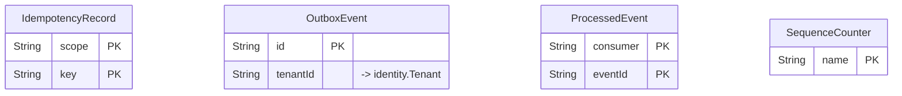

# `platform` schema

Owner: shared (outbox, idempotency, sequences) · 4 models · [all contexts](./README.md)

The diagram shows keys and relations; every column is listed in the reference below.

## IdempotencyRecord

Stored responses for Idempotency-Key protected endpoints.

Table `platform."IdempotencyRecord"`

| Column | Type | Null | Default | Notes |
| --- | --- | :---: | --- | --- |
| `scope` | String |  |  |  |
| `key` | String |  |  |  |
| `requestHash` | String |  |  |  |
| `responseStatus` | Int | ✓ |  |  |
| `responseBody` | Json | ✓ |  |  |
| `createdAt` | DateTime |  | now() |  |
| `expiresAt` | DateTime |  |  |  |

Constraints: primary key (scope, key)

## OutboxEvent

Transactional outbox. Rows are written in the same DB transaction as the
business change and relayed to Redis Streams by the owning service.

Table `platform."OutboxEvent"`

| Column | Type | Null | Default | Notes |
| --- | --- | :---: | --- | --- |
| `id` | String |  |  | PK |
| `source` | String |  |  |  |
| `stream` | String |  |  |  |
| `type` | String |  |  |  |
| `aggregateType` | String |  |  |  |
| `aggregateId` | String |  |  |  |
| `tenantId` | String | ✓ |  | → identity.Tenant |
| `payload` | Json |  |  |  |
| `occurredAt` | DateTime |  | now() |  |
| `publishedAt` | DateTime | ✓ |  |  |
| `attempts` | Int |  | 0 |  |
| `lastError` | String | ✓ |  |  |

## ProcessedEvent

Consumer-side de-duplication for at-least-once event delivery.

Table `platform."ProcessedEvent"`

| Column | Type | Null | Default | Notes |
| --- | --- | :---: | --- | --- |
| `consumer` | String |  |  |  |
| `eventId` | String |  |  |  |
| `eventType` | String |  |  |  |
| `processedAt` | DateTime |  | now() |  |

Constraints: primary key (consumer, eventId)

## SequenceCounter

Gap-free human readable numbering (order numbers, PO numbers, invoices).

Table `platform."SequenceCounter"`

| Column | Type | Null | Default | Notes |
| --- | --- | :---: | --- | --- |
| `name` | String |  |  | PK |
| `value` | BigInt |  | 0 |  |
| `updatedAt` | DateTime |  |  |  |
