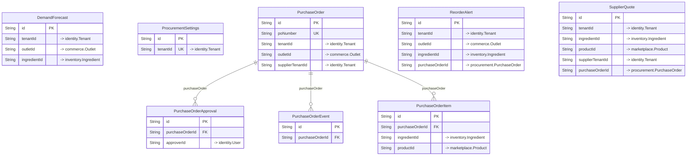

# `procurement` schema

Owner: procurement-service · 8 models · [all contexts](./README.md)

The diagram shows keys and relations; every column is listed in the reference below.

## DemandForecast

Table `procurement."DemandForecast"`

| Column | Type | Null | Default | Notes |
| --- | --- | :---: | --- | --- |
| `id` | String |  | cuid() | PK |
| `tenantId` | String |  |  | → identity.Tenant |
| `outletId` | String |  |  | → commerce.Outlet |
| `ingredientId` | String |  |  | → inventory.Ingredient |
| `forecastDate` | DateTime |  |  |  |
| `predictedQty` | Decimal |  |  |  |
| `lowerQty` | Decimal |  |  |  |
| `upperQty` | Decimal |  |  |  |
| `model` | String |  |  |  |
| `features` | Json |  | {} | Signals applied (festival / weather multipliers, seasonality index ...). |
| `generatedAt` | DateTime |  | now() |  |

Constraints: unique (ingredientId, forecastDate)

## ProcurementSettings

Table `procurement."ProcurementSettings"`

| Column | Type | Null | Default | Notes |
| --- | --- | :---: | --- | --- |
| `id` | String |  | cuid() | PK |
| `tenantId` | String |  |  | unique; → identity.Tenant |
| `autoPoEnabled` | Boolean |  | true |  |
| `autoApproveBelow` | Decimal |  | 0 | Auto-generated POs at or below this total skip owner approval. |
| `defaultStrategy` | enum SupplierStrategy |  | BALANCED |  |
| `forecastHorizonDays` | Int |  | 14 |  |
| `serviceLevel` | Float |  | 0.9500000000000001 | Target cycle-service level used to size safety stock (z-score). |
| `reviewPeriodDays` | Int |  | 7 |  |
| `createdAt` | DateTime |  | now() |  |
| `updatedAt` | DateTime |  |  |  |

## PurchaseOrder

Table `procurement."PurchaseOrder"`

| Column | Type | Null | Default | Notes |
| --- | --- | :---: | --- | --- |
| `id` | String |  | cuid() | PK |
| `poNumber` | String |  |  | unique |
| `tenantId` | String |  |  | → identity.Tenant |
| `outletId` | String |  |  | → commerce.Outlet |
| `supplierTenantId` | String |  |  | → identity.Tenant |
| `supplierName` | String |  |  |  |
| `status` | enum PurchaseOrderStatus |  | DRAFT |  |
| `source` | enum PurchaseOrderSource |  | MANUAL |  |
| `strategy` | enum SupplierStrategy | ✓ |  |  |
| `subtotal` | Decimal |  |  |  |
| `taxTotal` | Decimal |  |  |  |
| `deliveryCharge` | Decimal |  | 0 |  |
| `total` | Decimal |  |  |  |
| `currency` | String |  | INR |  |
| `paymentTerms` | String |  | PREPAID |  |
| `expectedDeliveryAt` | DateTime | ✓ |  |  |
| `deliveryAddress` | Json | ✓ |  |  |
| `notes` | String | ✓ |  |  |
| `createdBy` | String | ✓ |  |  |
| `submittedAt` | DateTime | ✓ |  |  |
| `approvedAt` | DateTime | ✓ |  |  |
| `approvedBy` | String | ✓ |  |  |
| `rejectedReason` | String | ✓ |  |  |
| `sentAt` | DateTime | ✓ |  |  |
| `supplierOrderId` | String | ✓ |  |  |
| `supplierConfirmedAt` | DateTime | ✓ |  |  |
| `supplierNotes` | String | ✓ |  |  |
| `dispatchedAt` | DateTime | ✓ |  |  |
| `deliveredAt` | DateTime | ✓ |  |  |
| `receivedAt` | DateTime | ✓ |  |  |
| `receivedBy` | String | ✓ |  |  |
| `trackingInfo` | Json | ✓ |  | { vehicleNumber, driverName, driverPhone, lat, lng, eta } |
| `createdAt` | DateTime |  | now() |  |
| `updatedAt` | DateTime |  |  |  |

## PurchaseOrderApproval

Table `procurement."PurchaseOrderApproval"`

| Column | Type | Null | Default | Notes |
| --- | --- | :---: | --- | --- |
| `id` | String |  | cuid() | PK |
| `purchaseOrderId` | String |  |  |  |
| `approverId` | String |  |  | → identity.User |
| `decision` | enum ApprovalDecision |  |  |  |
| `comment` | String | ✓ |  |  |
| `decidedAt` | DateTime |  | now() |  |

## PurchaseOrderEvent

Table `procurement."PurchaseOrderEvent"`

| Column | Type | Null | Default | Notes |
| --- | --- | :---: | --- | --- |
| `id` | String |  | cuid() | PK |
| `purchaseOrderId` | String |  |  |  |
| `status` | enum PurchaseOrderStatus |  |  |  |
| `note` | String | ✓ |  |  |
| `actorType` | String | ✓ |  |  |
| `actorId` | String | ✓ |  |  |
| `lat` | Float | ✓ |  |  |
| `lng` | Float | ✓ |  |  |
| `createdAt` | DateTime |  | now() |  |

## PurchaseOrderItem

Table `procurement."PurchaseOrderItem"`

| Column | Type | Null | Default | Notes |
| --- | --- | :---: | --- | --- |
| `id` | String |  | cuid() | PK |
| `purchaseOrderId` | String |  |  |  |
| `ingredientId` | String | ✓ |  | → inventory.Ingredient |
| `productId` | String | ✓ |  | → marketplace.Product |
| `name` | String |  |  |  |
| `sku` | String | ✓ |  |  |
| `quantity` | Decimal |  |  | Ordered quantity in supplier packs. |
| `unit` | String |  |  | Pack description, e.g. "25 KG". |
| `unitPrice` | Decimal |  |  | Pack price (pre-tax). |
| `gstRate` | Decimal |  |  |  |
| `taxAmount` | Decimal |  |  |  |
| `lineTotal` | Decimal |  |  |  |
| `baseQtyPerPack` | Decimal |  | 1 | Ingredient stock units per pack (conversion used on goods receipt). |
| `ingredientUnit` | String | ✓ |  |  |
| `confirmedQty` | Decimal | ✓ |  |  |
| `receivedQty` | Decimal |  | 0 |  |

## ReorderAlert

Table `procurement."ReorderAlert"`

| Column | Type | Null | Default | Notes |
| --- | --- | :---: | --- | --- |
| `id` | String |  | cuid() | PK |
| `tenantId` | String |  |  | → identity.Tenant |
| `outletId` | String |  |  | → commerce.Outlet |
| `ingredientId` | String |  |  | → inventory.Ingredient |
| `ingredientName` | String |  |  |  |
| `category` | String |  |  |  |
| `unit` | String |  |  |  |
| `currentStock` | Decimal |  |  |  |
| `reorderLevel` | Decimal |  |  |  |
| `avgDailyUsage` | Decimal |  |  |  |
| `daysOfCover` | Float |  |  |  |
| `predictedDepletionDate` | DateTime | ✓ |  |  |
| `suggestedQty` | Decimal |  |  |  |
| `severity` | enum AlertSeverity |  |  |  |
| `status` | enum ReorderAlertStatus |  | OPEN |  |
| `purchaseOrderId` | String | ✓ |  | → procurement.PurchaseOrder |
| `resolvedAt` | DateTime | ✓ |  |  |
| `createdAt` | DateTime |  | now() |  |
| `updatedAt` | DateTime |  |  |  |

## SupplierQuote

Ranked supplier comparison captured at decision time (explainability).

Table `procurement."SupplierQuote"`

| Column | Type | Null | Default | Notes |
| --- | --- | :---: | --- | --- |
| `id` | String |  | cuid() | PK |
| `tenantId` | String |  |  | → identity.Tenant |
| `ingredientId` | String |  |  | → inventory.Ingredient |
| `productId` | String |  |  | → marketplace.Product |
| `supplierTenantId` | String |  |  | → identity.Tenant |
| `supplierName` | String |  |  |  |
| `quantity` | Decimal |  |  |  |
| `unitPrice` | Decimal |  |  |  |
| `landedCost` | Decimal |  |  |  |
| `leadTimeHours` | Int |  |  |  |
| `rating` | Float |  |  |  |
| `onTimeRate` | Float |  |  |  |
| `score` | Float |  |  |  |
| `rank` | Int |  |  |  |
| `strategy` | enum SupplierStrategy |  |  |  |
| `purchaseOrderId` | String | ✓ |  | → procurement.PurchaseOrder |
| `generatedAt` | DateTime |  | now() |  |
