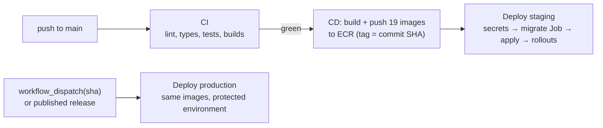

# Deployment

FoodGrid runs on AWS: one EKS cluster per environment (staging, production) in
`ap-south-1`, RDS PostgreSQL, ElastiCache, S3 + CloudFront for media, and an ALB in
front of the web apps and the API gateway. Terraform creates the infrastructure;
GitHub Actions builds the images and deploys the Kubernetes manifests.

## 1. Infrastructure (once per account and environment)

The details, including every command, are in
[infrastructure/terraform/README.md](../infrastructure/terraform/README.md). In short:

| Order | Stack             | Creates                                                                             |
| ----- | ----------------- | ----------------------------------------------------------------------------------- |
| 1     | `bootstrap`       | the S3 bucket that holds the other stacks' state                                    |
| 2     | `global`          | 19 ECR repositories, the GitHub OIDC provider, the CI push role                     |
| 3     | `envs/staging`    | VPC, EKS and add-ons, RDS, ElastiCache, S3/CloudFront, certificates, secrets, roles |
| 4     | `envs/production` | the same, sized for production, plus WAF                                            |

After the environment stacks:

1. **Fill the secrets.** Terraform creates `foodgrid/<env>/app`, `foodgrid/<env>/auth`
   and `foodgrid/<env>/payment` in Secrets Manager with every key the services need.
   It writes the values it owns (`DATABASE_URL`, `REDIS_URL`); add the JWT key pair,
   Razorpay keys, Google client ids and provider credentials yourself. External Secrets
   syncs them into the cluster.
2. **Create the application database role** with the SQL in the Terraform README
   (Terraform cannot reach the private database).
3. **Point DNS** for the ingress hosts at the ALB (or let Terraform create the records
   with `create_alb_dns_records = true` once the ALB exists).

## 2. GitHub setup

Copy the `github_variables` outputs into GitHub (the Terraform README has a
`gh variable set` loop):

| Scope                    | Variables                                                                                                                                     |
| ------------------------ | --------------------------------------------------------------------------------------------------------------------------------------------- |
| Repository               | `AWS_REGION`, `AWS_ACCOUNT_ID`, `ECR_REGISTRY`, `AWS_CI_ROLE_ARN`, `AWS_TERRAFORM_PLAN_ROLE_ARN` (optional), `TF_STATE_BUCKET` (for PR plans) |
| Environment `staging`    | `EKS_CLUSTER_NAME`, `AWS_DEPLOY_ROLE_ARN`, `ACM_CERTIFICATE_ID`                                                                               |
| Environment `production` | the same plus `WAF_WEB_ACL_ID`                                                                                                                |

Add required reviewers to the `production` environment. No long-lived AWS keys are
stored in GitHub: every job assumes a role through OIDC, and the roles only trust this
repository (the CI role only `main` and `v*` tags).

## 3. What CI and CD do

| Workflow        | Trigger                                                | Does                                                                                                       |
| --------------- | ------------------------------------------------------ | ---------------------------------------------------------------------------------------------------------- |
| `ci.yml`        | pull requests, pushes to `main`                        | format, lint, typecheck, unit tests, integration tests against Postgres + Redis, full build, Docker builds |
| `cd.yml`        | CI succeeded on `main`; manual; releases               | builds and pushes the images, then calls `deploy.yml`                                                      |
| `deploy.yml`    | called by CD                                           | renders the overlay, applies secrets, runs the migration Job, applies, waits for rollouts                  |
| `flutter.yml`   | changes under `packages/flutter_core`, `apps/*-mobile` | analyze and test the core and the three apps                                                               |
| `terraform.yml` | changes under `infrastructure/terraform`               | fmt and validate; plans on PRs when the plan role is set                                                   |

A deploy, step by step (`deploy.yml`):

1. Check every `foodgrid/<name>:<sha>` image exists in ECR.
2. Render the overlay with `.github/scripts/render-overlay.sh`: fill `ACCOUNT_ID`, the
   certificate id and the WAF id from the environment variables, pin every image to the
   commit, and fail if a placeholder or an unpinned image is left.
3. Apply the namespace and ExternalSecrets, and wait for the secrets to sync.
4. Delete the previous `db-migrate` Job, apply the new one and wait for it; on failure
   print its logs and stop. Migrations always run before new code.
5. Apply the whole overlay and wait for every Deployment to roll out.

Production promotes an image that already passed staging: run CD with
`workflow_dispatch` and the commit SHA, or publish a release. Nothing is rebuilt.

## Kubernetes layout

| Path                                       | What                                                                                                                                                                                                  |
| ------------------------------------------ | ----------------------------------------------------------------------------------------------------------------------------------------------------------------------------------------------------- |
| `infrastructure/kubernetes/base`           | generated by `pnpm k8s:generate` (`scripts/generate-k8s.ts`): Deployments, Services, HPAs, PDBs, NetworkPolicies, the nginx gateway, ingresses, ExternalSecrets, the migrate Job. Do not edit by hand |
| `infrastructure/kubernetes/overlays/<env>` | per-environment replicas, hosts, IRSA annotation, certificate and WAF, secret paths                                                                                                                   |
| `infrastructure/monitoring`                | ServiceMonitor, PrometheusRules (alerts link to the [runbooks](./runbooks.md)) and the Grafana dashboard                                                                                              |

Render an overlay locally with `kubectl kustomize infrastructure/kubernetes/overlays/staging`
(placeholders stay as they are), or exactly as CD does with the render script and the
variables from the table above.

## Rollback

Deploy the previous good SHA again: `gh workflow run cd.yml --ref main -f sha=<sha>` for
production (approve the environment), or re-run that commit's CD run for staging. Tags
are immutable and ECR keeps the last 300 builds of each image, so nothing is rebuilt.
Migrations only go forward, so each one must stay compatible with the release before
it. The [runbook](./runbooks.md#rolling-back-a-deploy) has the full procedure.
