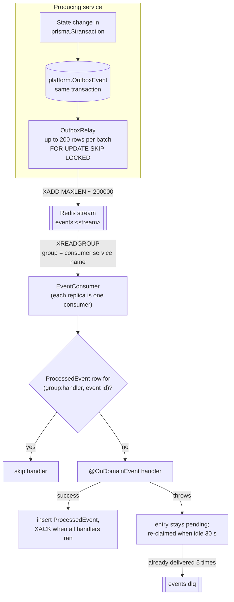

# Domain events

Services never call each other to report that something happened. They write a
domain event into a transactional outbox in the same database transaction as the
change, a relay publishes it to a Redis stream, and every interested service reads
it through its own consumer group. This page lists every stream and event type, who
publishes and who consumes it, the payloads, and the delivery guarantees.

Source of truth: `packages/types/src/events.ts` (names, payload interfaces),
`packages/utils/src/server/events/` (outbox, relay, consumer) and each service's
`src/events/*-event.handlers.ts` and `src/service.config.ts` (`SUBSCRIBED_STREAMS`).

## How an event travels

| Step        | Mechanism                                                                                                                                                                                                                                                                                              | Numbers                                                              |
| ----------- | ------------------------------------------------------------------------------------------------------------------------------------------------------------------------------------------------------------------------------------------------------------------------------------------------------ | -------------------------------------------------------------------- |
| Write       | `OutboxService.enqueue(tx, …)` inserts a `platform.OutboxEvent` row (`source` = service name) inside the caller's transaction, so the event exists if and only if the change commits.                                                                                                                  | —                                                                    |
| Relay       | `OutboxRelay` in every replica of the owning service selects its own unpublished rows `ORDER BY "occurredAt"` with `FOR UPDATE SKIP LOCKED`, publishes them and sets `publishedAt`. Replicas never relay the same row twice concurrently.                                                              | polls every 500 ms; 10 ms while a backlog drains; 200 rows per batch |
| Publish     | `XADD events:<stream> MAXLEN ~ 200000 * type <type> envelope <json>`                                                                                                                                                                                                                                   | streams are trimmed to roughly 200 000 entries                       |
| Clean-up    | Published rows older than 7 days are deleted (hourly).                                                                                                                                                                                                                                                 | 7 days                                                               |
| Consume     | One consumer group per service (group name = service name, e.g. `delivery-service`); each pod is a consumer named `<hostname>-<pid>`. A group is created at id `0` on first boot, so a new group starts from the oldest retained entry.                                                                | `COUNT 50`, `BLOCK 2000` ms                                          |
| Dispatch    | Every handler registered for the event type runs in turn. A handler is skipped if `platform.ProcessedEvent` already has `(consumer = "<group>:<Class>.<method>", eventId = envelope.id)`; after it succeeds that row is inserted. The entry is acknowledged (`XACK`) only when all handlers succeeded. | —                                                                    |
| Retry       | Unacknowledged entries idle for 30 s are re-claimed (`XPENDING` / `XCLAIM`, checked every 15 s) and processed again; handlers that already succeeded are skipped.                                                                                                                                      | reclaim every 15 s, idle ≥ 30 s                                      |
| Dead letter | An entry that has already been delivered 5 times is copied to `events:dlq` (fields `stream`, `group`, `entryId`, `type`, `envelope`) and acknowledged.                                                                                                                                                 | `MAX_DELIVERIES = 5`                                                 |

Guarantees and rules for handlers:

- **At-least-once.** The `ProcessedEvent` row is written after the handler commits, not
  in the same transaction, so a crash in between replays the handler. Every handler
  must be idempotent on its own (they check current state, use unique keys such as
  ledger idempotency keys, or look for an existing row first).
- **No global ordering.** Entries in one stream are appended in relay order, but
  replicas of a consumer read in parallel and a failed entry is retried after later
  ones. Handlers check the current state instead of assuming order (for example,
  order-service ignores `delivery.delivered` for an order that is already `DELIVERED`).
- Switches: `OUTBOX_RELAY_ENABLED` and `EVENTS_CONSUMER_ENABLED` (both default `true`;
  the integration tests turn them off).
- Metrics: `domain_events_published_total{type}` (relay) and
  `domain_events_processed_total{type,outcome}` (`success` / `error`) per service. The
  [event consumer errors](./runbooks.md#event-consumer-errors) alert watches the latter.

## Envelope

Every stream entry carries the envelope as JSON in the `envelope` field (and the type
again in `type`).

| Field                          | Type           | Meaning                                                            |
| ------------------------------ | -------------- | ------------------------------------------------------------------ |
| `id`                           | string (UUID)  | Outbox row id; the de-duplication key.                             |
| `type`                         | string         | Event type, e.g. `order.accepted`.                                 |
| `source`                       | string         | Producing service, e.g. `order-service`.                           |
| `stream`                       | string         | One of the streams below.                                          |
| `occurredAt`                   | ISO 8601       | When the outbox row was written.                                   |
| `tenantId`                     | string or null | Owning tenant, when there is one.                                  |
| `aggregateType`, `aggregateId` | string         | The entity the event is about (`Order`, `Delivery`, `Payment`, …). |
| `data`                         | object         | Payload, see each stream.                                          |
| `version`                      | `1`            | Envelope version.                                                  |

Money values (`Money`) are decimal strings such as `"249.00"`.

## Who subscribes to what

| Service              | Streams consumed (`SUBSCRIBED_STREAMS`)                                 |
| -------------------- | ----------------------------------------------------------------------- |
| auth-service         | —                                                                       |
| user-service         | —                                                                       |
| order-service        | payment, delivery, identity                                             |
| payment-service      | order, delivery, marketplace                                            |
| inventory-service    | order, procurement                                                      |
| procurement-service  | inventory, marketplace                                                  |
| delivery-service     | order, identity                                                         |
| supplier-service     | procurement, identity                                                   |
| analytics-service    | order, payment, delivery, marketplace, inventory, identity              |
| ads-service          | order, identity                                                         |
| notification-service | order, payment, delivery, inventory, procurement, marketplace, identity |
| ai-service           | —                                                                       |

A service only receives the streams it subscribes to, and inside them only the types it
has a handler for; other entries are acknowledged without effect.

## Stream `identity` (`events:identity`)

| Event type                       | Published by                                                                                                                               | Consumed by                                                                                                                                                                                                                                                                         |
| -------------------------------- | ------------------------------------------------------------------------------------------------------------------------------------------ | ----------------------------------------------------------------------------------------------------------------------------------------------------------------------------------------------------------------------------------------------------------------------------------- |
| `identity.user.registered`       | auth-service, when a user is created on first OTP or Google login (`auth.service.ts`)                                                      | analytics-service: counts new customers for the day (IST). notification-service: in-app welcome (`user.welcome`).                                                                                                                                                                   |
| `identity.tenant.status_changed` | user-service, when an admin changes a tenant's status (`admin.service.ts`) or an approval activates or rejects it (`approvals.service.ts`) | order-service: `SUSPENDED` suspends the tenant's active or paused outlets and closes them; `ACTIVE` moves suspended outlets to `PAUSED`. supplier-service: drops its tenant cache; `SUSPENDED` delists the seller's products.                                                       |
| `identity.approval.decided`      | user-service, when back office decides an approval request (`approvals.service.ts`)                                                        | order-service: `OUTLET` → outlet `ACTIVE` (approved) or `DRAFT`. delivery-service: `RIDER` → rider `ACTIVE`, `REJECTED` or back to `PENDING_APPROVAL`. ads-service: `AD_CAMPAIGN` approved or rejected. notification-service: push and email to the submitter (`approval.decided`). |
| `identity.rider.status_changed`  | defined in `EventTypes`, not published anywhere yet                                                                                        | —                                                                                                                                                                                                                                                                                   |

Payloads:

| Interface                  | Fields                                                                                                                                                                                                           |
| -------------------------- | ---------------------------------------------------------------------------------------------------------------------------------------------------------------------------------------------------------------- |
| `UserRegisteredEvent`      | `userId`, `phone`, `email`, `name`, `referredBy` (each string or null except `userId`)                                                                                                                           |
| `TenantStatusChangedEvent` | `tenantId`, `tenantType`, `status`, `reason?`                                                                                                                                                                    |
| `ApprovalDecidedEvent`     | `approvalId`, `entityType` (`TENANT` / `OUTLET` / `RIDER` / `PRODUCT` / `AD_CAMPAIGN`), `entityId`, `tenantId`, `decision` (`APPROVED` / `REJECTED` / `CHANGES_REQUESTED`), `notes`, `reviewedBy`, `submittedBy` |
| `RiderStatusChangedEvent`  | `riderId`, `userId`, `status`                                                                                                                                                                                    |

## Stream `order` (`events:order`)

All status events are published by `OrderLifecycleService` in order-service, the single
place where an order's status changes (see the
[order state machine](./architecture.md#order-and-delivery-state-machines)). The event
type follows the new status; `PICKED_UP` and `OUT_FOR_DELIVERY` both publish
`order.picked_up`.

| Event type             | Published when                                                                                                                                                                 | Consumed by                                                                                                                                                                                                                                                                                                              |
| ---------------------- | ------------------------------------------------------------------------------------------------------------------------------------------------------------------------------ | ------------------------------------------------------------------------------------------------------------------------------------------------------------------------------------------------------------------------------------------------------------------------------------------------------------------------ |
| `order.created`        | App checkout creates an order (any payment method; `checkout.service.ts`)                                                                                                      | No consumer today.                                                                                                                                                                                                                                                                                                       |
| `order.placed`         | The order reaches the kitchen: COD checkout, `payment.captured` for a prepaid order, a QR, POS or daily meal-plan order (POS orders are then accepted in the same transaction) | analytics-service: order fact. notification-service: merchant push to OWNER / MANAGER / CASHIER (`order.placed.merchant`), in-app note to the customer. delivery-service: `order:new` on the outlet's socket room. ads-service: records a conversion if the customer clicked an ad for that outlet in the last 24 hours. |
| `order.accepted`       | Merchant accepts (or a POS order is created)                                                                                                                                   | delivery-service: creates the delivery for `DELIVERY` orders and starts dispatch; `order:status` to the outlet room. inventory-service: recipe-based stock consumption, then publishes `inventory.stock.consumed`. analytics-service, notification-service (customer push, not for POS).                                 |
| `order.preparing`      | First kitchen ticket started, or merchant marks preparing                                                                                                                      | delivery-service: outlet room only.                                                                                                                                                                                                                                                                                      |
| `order.ready`          | All kitchen tickets ready, or merchant marks ready                                                                                                                             | delivery-service: stamps `readyAt`, tells the assigned rider (`order:ready`) or dispatches if nobody has it yet. notification-service: customer push for takeaway. analytics-service.                                                                                                                                    |
| `order.picked_up`      | Order moves to `OUT_FOR_DELIVERY` (after `delivery.picked_up`)                                                                                                                 | notification-service: customer push with the delivery OTP. analytics-service, delivery-service (outlet room).                                                                                                                                                                                                            |
| `order.delivered`      | Delivery completed                                                                                                                                                             | payment-service: accrues the merchant settlement line and publishes `payment.commission.accrued`. notification-service, analytics-service, delivery-service (outlet room).                                                                                                                                               |
| `order.completed`      | Takeaway / dine-in handed over (POS complete or merchant)                                                                                                                      | payment-service: accrues the settlement line (none for counter sales) and publishes `payment.commission.accrued`. analytics-service, delivery-service (outlet room).                                                                                                                                                     |
| `order.cancelled`      | Customer, merchant, unpaid-order expiry (15 min), or `delivery.failed`                                                                                                         | payment-service: refunds every captured payment for the order. delivery-service: cancels the delivery and open offers, frees the rider, tells the rider. notification-service, analytics-service.                                                                                                                        |
| `order.rejected`       | Merchant rejects, or no answer within 12 min (app and web orders)                                                                                                              | Same consumers as `order.cancelled`.                                                                                                                                                                                                                                                                                     |
| `order.review.created` | Customer reviews a delivered order (`reviews.service.ts`)                                                                                                                      | delivery-service: folds `deliveryRating` into the rider's running average.                                                                                                                                                                                                                                               |

Payload of every status event (`OrderStatusChangedEvent` = `OrderSnapshot` + extras):

| Field                                                                                                                   | Type                                | Notes                                                                                                                              |
| ----------------------------------------------------------------------------------------------------------------------- | ----------------------------------- | ---------------------------------------------------------------------------------------------------------------------------------- |
| `orderId`, `orderNumber`, `tenantId`, `outletId`                                                                        | string                              |                                                                                                                                    |
| `outletName`, `outletType`, `outletCity`, `outletAddress`                                                               | string                              |                                                                                                                                    |
| `outletLat`, `outletLng`                                                                                                | number                              | Pickup point for dispatch.                                                                                                         |
| `outletPhone`                                                                                                           | string or null                      |                                                                                                                                    |
| `customerId`, `customerName`, `customerPhone`                                                                           | string or null                      | Null for anonymous POS / counter orders.                                                                                           |
| `channel`                                                                                                               | `APP` / `WEB` / `QR` / `POS`        |                                                                                                                                    |
| `type`                                                                                                                  | `DELIVERY` / `TAKEAWAY` / `DINE_IN` |                                                                                                                                    |
| `status`                                                                                                                | `OrderStatus`                       | New status.                                                                                                                        |
| `paymentMethod`                                                                                                         | `PaymentMethod` or null             | `COD` makes the delivery collect cash.                                                                                             |
| `subtotal`, `discount`, `deliveryFee`, `platformFee`, `packagingCharge`, `taxTotal`, `tip`, `total`, `merchantDiscount` | Money                               |                                                                                                                                    |
| `commissionRate`, `commissionAmount`                                                                                    | Money or null                       | Null until payment-service has charged the order (`payment.commission.accrued`).                                                   |
| `couponFundedBy`                                                                                                        | string or null                      |                                                                                                                                    |
| `deliveryAddress`                                                                                                       | `AddressSnapshot` or null           | `line1`, `line2?`, `landmark?`, `city`, `state`, `pincode`, `lat`, `lng`, `label?`, `contactName?`, `contactPhone?`                |
| `distanceKm`                                                                                                            | number or null                      |                                                                                                                                    |
| `items`                                                                                                                 | `OrderLineSnapshot[]`               | `menuItemId`, `name`, `quantity`, `unitPrice`, `totalPrice`                                                                        |
| `placedAt`                                                                                                              | ISO string or null                  | Null until the order is placed; consumers use it to ignore never-paid orders.                                                      |
| `isFirstOrder?`                                                                                                         | boolean                             |                                                                                                                                    |
| `deliveryOtp?`                                                                                                          | string or null                      | Handover OTP for internal consumers. Never forward it to merchants (delivery-service picks fields one by one for the outlet room). |
| `estimatedReadyAt?`                                                                                                     | ISO string or null                  |                                                                                                                                    |
| `previousStatus`                                                                                                        | `OrderStatus` or null               |                                                                                                                                    |
| `reason?`                                                                                                               | string or null                      | Cancel / reject reason.                                                                                                            |
| `riderId?`                                                                                                              | string or null                      |                                                                                                                                    |
| `prepMins?`, `deliveryMins?`, `promisedMins?`                                                                           | number or null                      | Accepted → ready, placed → delivered/completed, placed → promised delivery time.                                                   |

`ReviewCreatedEvent`: `reviewId`, `orderId`, `outletId`, `tenantId`, `riderId`, `rating`, `deliveryRating`.

## Stream `payment` (`events:payment`)

| Event type                   | Published by (payment-service `payments.service.ts`)                                                                                                                                                                                             | Consumed by                                                                                                                                                                                                                                       |
| ---------------------------- | ------------------------------------------------------------------------------------------------------------------------------------------------------------------------------------------------------------------------------------------------ | ------------------------------------------------------------------------------------------------------------------------------------------------------------------------------------------------------------------------------------------------- |
| `payment.captured`           | A payment moves to `CAPTURED`: Checkout verify, Razorpay webhook (`payment.captured`, `order.paid`), sandbox completion or a wallet payment. Only the first capture publishes (client vs webhook race).                                          | order-service: `ORDER` → order `PLACED` (or, if the order was already cancelled, marks it paid and re-publishes the cancellation so the money is refunded); `MEMBERSHIP` → activates the membership; `MEAL_SUBSCRIPTION` → subscription `ACTIVE`. |
| `payment.failed`             | A `CREATED` / `AUTHORIZED` payment fails                                                                                                                                                                                                         | order-service: `ORDER` → `paymentStatus = FAILED` while still `PENDING_PAYMENT`. notification-service: customer push (`payment.failed`).                                                                                                          |
| `payment.refund.processed`   | A refund completes (to the instrument or the wallet)                                                                                                                                                                                             | order-service: `ORDER` → `REFUNDED` or `PARTIALLY_REFUNDED`. notification-service registers a handler that does nothing yet.                                                                                                                      |
| `payment.commission.accrued` | `settlements.service.ts`, once per order on `order.delivered` / `order.completed`: the commission charged by the most specific active rule (a business override is a business-wide rule), or `0.00` for counter sales (POS, cash at the counter) | order-service: stores `commissionRate` / `commissionAmount` on the order. analytics-service: sets the order fact's commission and platform revenue (retries until the order fact exists).                                                         |

| Interface                | Fields                                                                                                                                                                                                                 |
| ------------------------ | ---------------------------------------------------------------------------------------------------------------------------------------------------------------------------------------------------------------------- |
| `PaymentEvent`           | `paymentId`, `purpose` (`ORDER` / `WALLET_TOPUP` / `MEMBERSHIP` / `MEAL_SUBSCRIPTION` / `B2B_ORDER` / `AD_CAMPAIGN`), `referenceId` (the order, membership, … id), `userId`, `tenantId`, `amount`, `method`, `reason?` |
| `RefundProcessedEvent`   | `refundId`, `paymentId`, `purpose`, `referenceId`, `amount`, `toWallet`                                                                                                                                                |
| `CommissionAccruedEvent` | `orderId`, `tenantId`, `outletId`, `commissionRate` (percent of the merchant's sales), `commissionAmount`                                                                                                              |

Wallet top-ups are credited by payment-service itself in the capture transaction; no
other service needs to react.

## Stream `delivery` (`events:delivery`)

| Event type                    | Published by (delivery-service)                                  | Consumed by                                                                                                                                                                                                                                                                                                            |
| ----------------------------- | ---------------------------------------------------------------- | ---------------------------------------------------------------------------------------------------------------------------------------------------------------------------------------------------------------------------------------------------------------------------------------------------------------------- |
| `delivery.assigned`           | A rider accepts an offer (`dispatch.service.ts`)                 | order-service: stores `riderId` on the order. notification-service: customer push (`delivery.assigned`).                                                                                                                                                                                                               |
| `delivery.picked_up`          | Rider confirms pickup (`deliveries.service.ts`)                  | order-service: moves the order to `READY` if needed, then `OUT_FOR_DELIVERY`.                                                                                                                                                                                                                                          |
| `delivery.delivered`          | Rider completes with the customer's OTP inside the drop geofence | order-service: `DELIVERED` (COD orders become `PAID`; meal subscriptions count the meal). payment-service: credits the rider wallet with `DELIVERY_EARNING` and `TIP`, debits `COD_COLLECTION` for cash orders (may go negative, see [COD netting](./architecture.md#delivery)). analytics-service: rider daily stats. |
| `delivery.failed`             | Rider marks the delivery failed                                  | order-service: cancels the order (which triggers the refund).                                                                                                                                                                                                                                                          |
| `delivery.incentive.achieved` | A rider reaches an incentive target (delivery or going offline)  | payment-service: credits the reward (`INCENTIVE`). notification-service: rider push (`rider.incentive`).                                                                                                                                                                                                               |

| Interface                | Fields                                                                                                                                                                                                                                                                                                                                                                                                                     |
| ------------------------ | -------------------------------------------------------------------------------------------------------------------------------------------------------------------------------------------------------------------------------------------------------------------------------------------------------------------------------------------------------------------------------------------------------------------------- |
| `DeliveryEvent`          | `deliveryId`, `orderId`, `orderNumber`, `tenantId`, `outletId`, `customerId`, `riderId`, `riderUserId?` (wallet owner), `riderName?`, `riderPhone?`, `status`, `distanceKm`, `riderEarning`, `tipAmount`, `isCod`, `codAmount`, `occurredAt`, `deliveryMins?`. order-service reads an optional `reason` from `delivery.failed`, but delivery-service does not send one yet, so the order is cancelled with a generic note. |
| `IncentiveAchievedEvent` | `riderIncentiveId`, `riderId`, `userId`, `schemeName`, `rewardAmount`                                                                                                                                                                                                                                                                                                                                                      |

## Stream `inventory` (`events:inventory`)

| Event type                 | Published by (inventory-service)                                                               | Consumed by                                                                                                                                                                                                                                   |
| -------------------------- | ---------------------------------------------------------------------------------------------- | --------------------------------------------------------------------------------------------------------------------------------------------------------------------------------------------------------------------------------------------- |
| `inventory.stock.low`      | A stock movement takes an ingredient across its reorder level, or to zero (`stock.service.ts`) | procurement-service: re-scores reorder alerts for that ingredient; with auto-PO enabled, raises purchase orders for `CRITICAL` / `HIGH` alerts. notification-service: push to OWNER / MANAGER / PROCUREMENT_MANAGER / CHEF (`inventory.low`). |
| `inventory.stock.consumed` | After recipe-based consumption for an accepted order (`inventory-event.handlers.ts`)           | analytics-service: food cost on the order fact.                                                                                                                                                                                               |

| Interface            | Fields                                                                                                                                                              |
| -------------------- | ------------------------------------------------------------------------------------------------------------------------------------------------------------------- |
| `StockLowEvent`      | `tenantId`, `outletId`, `ingredientId`, `ingredientName`, `category`, `unit`, `currentStock`, `reorderLevel`, `reorderQty` (decimal strings), `marketplaceCategory` |
| `StockConsumedEvent` | `tenantId`, `outletId`, `orderId`, `lines[]` (`ingredientId`, `quantity`, `cost`), `foodCost`                                                                       |

## Stream `procurement` (`events:procurement`)

Published by procurement-service (`purchase-orders.service.ts`) when a purchase order
enters the matching status.

| Event type                 | Published when                       | Consumed by                                                                                                                                                                                                                                                                                                                                                                        |
| -------------------------- | ------------------------------------ | ---------------------------------------------------------------------------------------------------------------------------------------------------------------------------------------------------------------------------------------------------------------------------------------------------------------------------------------------------------------------------------- |
| `procurement.po.submitted` | PO → `PENDING_APPROVAL`              | notification-service: push to the tenant OWNER (`procurement.po.approval`).                                                                                                                                                                                                                                                                                                        |
| `procurement.po.approved`  | PO approved and → `SENT_TO_SUPPLIER` | supplier-service: creates the B2B sales order (once per PO) at the supplier's current catalogue price for that buyer, with any dealer discount applied once; the PO's prices are only the buyer's estimate; if a business rule fails (MOQ, stock, serviceability) it publishes `marketplace.order.rejected` instead. notification-service: push to the supplier's OWNER / MANAGER. |
| `procurement.po.rejected`  | PO → `REJECTED`                      | No consumer today.                                                                                                                                                                                                                                                                                                                                                                 |
| `procurement.po.cancelled` | PO → `CANCELLED`                     | supplier-service: cancels the linked B2B order unless it has shipped.                                                                                                                                                                                                                                                                                                              |
| `procurement.po.received`  | Goods receipt recorded               | inventory-service: receives each line into stock (once per PO).                                                                                                                                                                                                                                                                                                                    |

| Interface                    | Fields                                                                                                                                                                                                                                                                           |
| ---------------------------- | -------------------------------------------------------------------------------------------------------------------------------------------------------------------------------------------------------------------------------------------------------------------------------- |
| `PurchaseOrderEvent`         | `purchaseOrderId`, `poNumber`, `tenantId`, `buyerName`, `outletId`, `supplierTenantId`, `status`, `total`, `paymentTerms`, `expectedDeliveryAt`, `deliveryAddress`, `items[]` (`ingredientId`, `productId`, `name`, `sku`, `quantity`, `unit`, `unitPrice`, `gstRate`), `notes?` |
| `PurchaseOrderReceivedEvent` | `purchaseOrderId`, `poNumber`, `tenantId`, `outletId`, `supplierTenantId`, `lines[]` (`ingredientId`, `receivedQty`, `unitPrice`, `unit`)                                                                                                                                        |

## Stream `marketplace` (`events:marketplace`)

Published by supplier-service (`b2b-orders.service.ts`) when a B2B order changes
status. `CONFIRMED` and `PARTIALLY_CONFIRMED` share `marketplace.order.confirmed`;
`REJECTED` and `CANCELLED` share `marketplace.order.rejected`.

| Event type                     | Consumed by                                                                                                                                                                                              |
| ------------------------------ | -------------------------------------------------------------------------------------------------------------------------------------------------------------------------------------------------------- |
| `marketplace.order.placed`     | procurement-service: PO → `SENT_TO_SUPPLIER` with the billed amounts. analytics-service: supplier and platform B2B stats.                                                                                |
| `marketplace.order.confirmed`  | procurement-service: PO → `CONFIRMED` or `PARTIALLY_CONFIRMED` (with confirmed quantities). notification-service: push to the buyer (`marketplace.order.update`).                                        |
| `marketplace.order.rejected`   | procurement-service: PO → `SUPPLIER_REJECTED`. payment-service: refunds payments for the B2B order. analytics-service: rejected count (only when a B2B order existed). notification-service: buyer push. |
| `marketplace.order.dispatched` | procurement-service: PO → `DISPATCHED` with tracking. notification-service: buyer push.                                                                                                                  |
| `marketplace.order.in_transit` | procurement-service: PO → `IN_TRANSIT`.                                                                                                                                                                  |
| `marketplace.order.delivered`  | procurement-service: PO → `DELIVERED`. payment-service: accrues the seller settlement. analytics-service: delivered and on-time counts. notification-service: buyer push.                                |

`B2bOrderEvent`: `b2bOrderId`, `orderNumber`, `buyerTenantId`, `sellerTenantId`,
`sourcePurchaseOrderId` (null for orders placed directly on the marketplace),
`status`, `total`, `note?`, `expectedDeliveryAt?`, `trackingInfo?`, `confirmedLines?`
(`productId`, `confirmedQty`), `onTime?`, and on placement / confirmation `subtotal?`,
`discount?`, `taxTotal?`, `deliveryCharge?`, `isInterState?`, `paymentTerms?`. The
rejection that supplier-service publishes when a PO cannot become an order has empty
`b2bOrderId` and `orderNumber`.

## Stream `ads` (`events:ads`)

Declared in `EVENT_STREAMS`, but nothing publishes to it or consumes it yet.
ads-service records impressions, clicks and conversions in its own tables.

## Adding an event

1. Add the type to `EventTypes` and its payload interface to
   `packages/types/src/events.ts`.
2. Publish it with `OutboxService.enqueue(tx, { stream, type, aggregateType, aggregateId, tenantId, data })`
   inside the transaction that makes the change; never with `EventPublisher` directly
   for anything tied to a database write.
3. In each consumer, add the stream to `SUBSCRIBED_STREAMS` if it is not there and a
   provider method decorated with `@OnDomainEvent(EventTypes.X)`. Make it idempotent and
   tolerant of out-of-order delivery.
4. Update this page.
